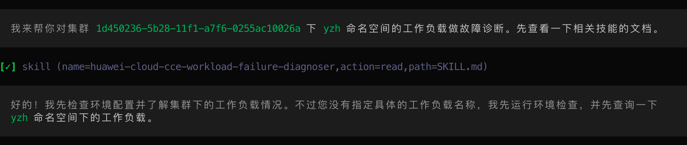
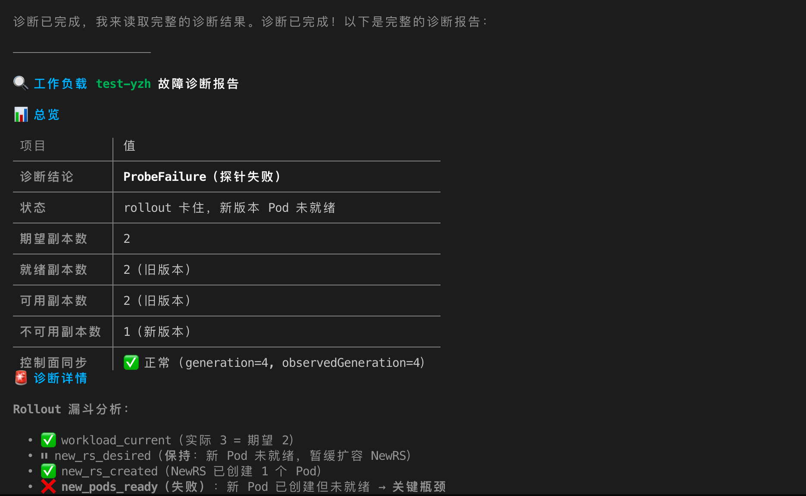
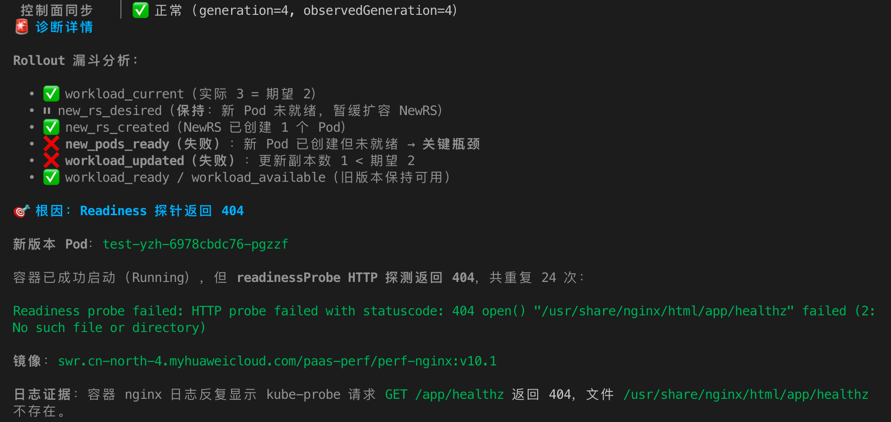
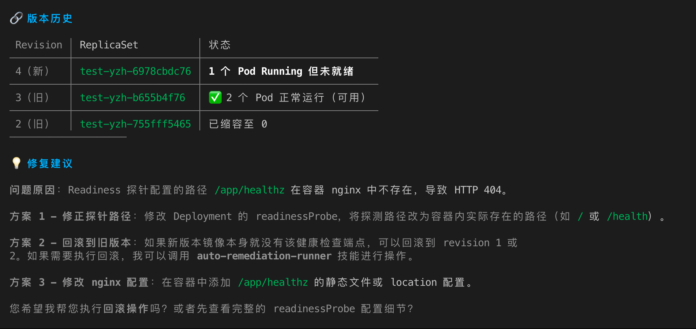
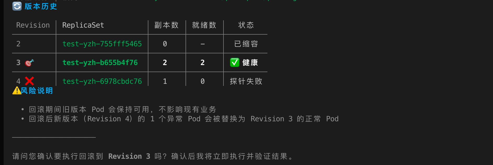

# 最佳实践：使用alcli对CCE工作负载进行故障诊断与恢复

## 应用场景

在云原生生产环境中，工作负载发布后出现新版本Pod无法就绪、滚动升级长时间卡住、业务流量仍由旧版本承载等问题，是CCE集群中常见的发布类故障。此类问题通常涉及Deployment滚动更新策略、ReplicaSet版本历史、Pod健康检查、容器日志、Kubernetes事件以及回滚恢复等多个排查面。

通过在CCE集群中部署alcli工作负载，并结合云原生Skill能力，可以使用自然语言完成以下操作：

- 自动识别目标集群、命名空间和异常工作负载。
- 汇聚Deployment、ReplicaSet、Pod、Events、容器日志等诊断证据。
- 定位Pod未就绪、探针失败、镜像异常、调度异常等故障根因。
- 输出受控恢复方案，并在用户确认后执行回滚或修复。
- 自动验证恢复结果，形成完整的故障诊断和恢复闭环。

本文以CCE集群中 `yzh` 命名空间下 `test-yzh` 工作负载更新后无法正常启动为例，介绍如何使用alcli完成一次工作负载故障诊断与回滚恢复。

## 方案概述

本实践采用“诊断先行、证据闭环、恢复确认、结果验证”的方式处理工作负载故障。alcli运行在CCE集群中的容器内，用户通过 `kubectl exec` 进入容器后，以自然语言描述问题。alcli根据问题自动调用相关Skill，完成目标识别、故障分析、恢复预览、用户确认、执行回滚和恢复验证。

整体流程如下：

```text
用户描述故障
  |
  |-- alcli读取工作负载故障诊断Skill
  |
  |-- 采集Deployment/ReplicaSet/Pod/Events/日志
  |
  |-- 判断Rollout是否卡住及新版本Pod是否Ready
  |
  |-- 定位readinessProbe失败根因
  |
  |-- 生成恢复建议
  |
  |-- 用户确认回滚
  |
  |-- 调用自动恢复Skill执行回滚
  |
  |-- 验证Deployment、ReplicaSet和Pod状态
```

## 前提条件

执行本实践前，请确保已完成以下准备工作。

| 类型 | 要求 |
| --- | --- |
| CCE集群 | 已创建CCE集群，并可通过公网或内网访问Kubernetes API Server。 |
| kubectl | 本地或运维节点已配置目标集群kubeconfig，可执行 `kubectl get nodes`。 |
| alcli工作负载 | 已在CCE集群中部署alcli容器镜像，并可通过 `kubectl exec` 进入容器。 |
| 权限 | alcli使用的凭证具备读取工作负载、Pod、Events、日志以及执行回滚操作的权限。 |
| 目标应用 | CCE集群中已部署目标Deployment，并保留可回滚的ReplicaSet历史版本。 |

本文示例环境如下。

| 项目 | 示例值 |
| --- | --- |
| 区域 | `cn-north-4` |
| 集群ID | `1d450236-5b28-11f1-a7f6-0255ac10026a` |
| 命名空间 | `yzh` |
| 工作负载 | `test-yzh` |
| 工作负载类型 | `Deployment` |
| 容器镜像 | `swr.cn-north-4.myhuaweicloud.com/paas-perf/perf-nginx:v10.1` |
| 故障类型 | `ProbeFailure`，新版本Pod未就绪 |

## 涉及的Skill

| Skill名称 | 作用 |
| --- | --- |
| `huawei-cloud-cce-workload-failure-diagnoser` | 对CCE工作负载执行故障诊断，分析Deployment、ReplicaSet、Pod、Events和日志证据。 |
| `huawei-cloud-cce-auto-remediation-runner` | 根据诊断结论执行受控恢复动作，例如回滚、重启、扩缩容等。 |

## 操作步骤

### 步骤1：进入alcli容器

在本地终端中执行以下命令，进入已部署的alcli工作负载容器。

```bash
kubectl -n aicli exec -it deploy/aicli -- bash
```

进入容器后，启动alcli交互会话。

```bash
aicli chat
```

说明：如果您的镜像中命令名称为 `alcli`，请将上述命令中的 `aicli` 替换为实际命令。

### 步骤2：使用自然语言描述故障

在alcli会话中输入如下问题。

```text
请帮我对1d450236-5b28-11f1-a7f6-0255ac10026a集群下yzh命名空间下的工作负载做一次故障诊断，好像更新后就无法正常启动了。
```

alcli接收到问题后，首先读取工作负载故障诊断Skill，并根据集群ID和命名空间开始环境检查。由于用户未指定具体工作负载名称，alcli会先查询 `yzh` 命名空间下的工作负载列表，再选择异常工作负载进行深入分析。



### 步骤3：查看诊断总览

alcli完成数据采集后，输出 `test-yzh` 工作负载的诊断报告总览。



从总览信息可以看出：

| 检查项 | 结果 |
| --- | --- |
| 诊断结论 | `ProbeFailure`，探针失败 |
| Rollout状态 | 卡住，新版本Pod未就绪 |
| 期望副本数 | `2` |
| 就绪副本数 | `2`，由旧版本Pod提供 |
| 可用副本数 | `2`，由旧版本Pod提供 |
| 不可用副本数 | `1`，新版本Pod不可用 |
| 控制面同步 | 正常，`generation=4`、`observedGeneration=4` |

该结果说明，Deployment控制面状态已同步，但滚动发布没有完成。旧版本Pod仍保持可用，因此业务未完全中断；新版本Pod创建后无法通过就绪探针，导致Rollout卡住。

### 步骤4：分析Rollout卡住原因

alcli进一步展开Rollout漏斗分析，对Deployment滚动更新链路进行逐项检查。



Rollout漏斗分析结果如下。

| 检查项 | 诊断结果 | 说明 |
| --- | --- | --- |
| `workload_current` | 通过 | 实际副本数满足期望副本数。 |
| `new_rs_desired` | 通过 | 新ReplicaSet进入发布流程，暂缓继续扩容。 |
| `new_rs_created` | 通过 | 新ReplicaSet已创建1个Pod。 |
| `new_pods_ready` | 失败 | 新Pod已创建但未就绪，是关键瓶颈。 |
| `workload_updated` | 失败 | 更新副本数小于期望副本数。 |
| `workload_ready` | 通过 | 旧版本Pod保持可用，业务具备基本可用性。 |

alcli定位到异常Pod为：

```text
test-yzh-6978cbdc76-pgzzf
```

关键事件如下：

```text
Readiness probe failed: HTTP probe failed with statuscode: 404
open() "/usr/share/nginx/html/app/healthz" failed (2: No such file or directory)
```

该事件表明，容器已成功启动并处于Running状态，但就绪探针访问 `/app/healthz` 时返回HTTP 404。对于nginx容器，实际访问路径映射到 `/usr/share/nginx/html/app/healthz`，该文件不存在，导致kubelet持续判定Pod未就绪。

### 步骤5：查看版本历史与修复建议

alcli继续查询Deployment的版本历史，判断是否存在可回滚的健康版本。



版本历史信息如下。

| Revision | ReplicaSet | 状态 |
| --- | --- | --- |
| `4`，新版本 | `test-yzh-6978cbdc76` | 1个Pod Running但未就绪 |
| `3`，旧版本 | `test-yzh-b655b4f76` | 2个Pod正常运行，可用 |
| `2`，旧版本 | `test-yzh-755fff5465` | 已缩容至0 |

alcli给出三类修复建议。

| 方案 | 适用场景 | 影响 |
| --- | --- | --- |
| 修改探针路径 | 新版本镜像可用，但readinessProbe路径配置错误。 | 需要修改Deployment配置并重新发布。 |
| 回滚到旧版本 | 新版本镜像或探针配置存在缺陷，需要快速恢复业务。 | 将工作负载恢复到上一个健康ReplicaSet。 |
| 修改nginx配置或静态文件 | 新版本需要继续使用 `/app/healthz` 路径。 | 需要补齐容器内文件或location配置后重新发布。 |

本案例的恢复目标是优先恢复业务可用性，因此选择回滚到健康的Revision 3。

### 步骤6：预览回滚方案

用户要求alcli执行回滚恢复后，alcli不会立即变更集群状态，而是先调用自动恢复Skill生成回滚预览。


回滚方案摘要如下。

| 项目 | 内容 |
| --- | --- |
| 操作 | `huawei_rollback_cce_workload` |
| 目标 | Deployment `test-yzh`，命名空间 `yzh` |
| 风险等级 | `R2`，运行时影响 |
| 当前版本 | Revision 4，1个Pod Running但未就绪 |
| 目标版本 | Revision 3，2个Pod正常运行就绪 |
| 镜像 | `swr.cn-north-4.myhuaweicloud.com/paas-perf/perf-nginx:v10.1` |

回滚前版本状态如下。



风险说明：

- 回滚期间旧版本Pod保持可用，不影响现有业务访问。
- 回滚后Revision 4的异常Pod会被替换为Revision 3的正常Pod。
- 回滚操作会改变Deployment模板，建议在变更窗口内执行，并保留操作记录。

### 步骤7：确认并执行回滚

用户确认回滚到Revision 3后，alcli调用自动恢复Skill执行回滚。回滚提交后，Deployment生成新的Generation，并由健康ReplicaSet承载目标副本数。

alcli输出的恢复结果如下。


恢复后的关键指标如下。

| 指标 | 结果 |
| --- | --- |
| 回滚提交 | 从Revision 4回滚到Revision 3 |
| 新Generation | `5` |
| 期望副本数 | `2` |
| 就绪副本数 | `2` |
| 可用副本数 | `2` |
| 控制面同步 | 已同步 |
| 当前活跃ReplicaSet | `test-yzh-b655b4f76` |
| 状态条件 | `Available=True`，`Progressing=True` |

alcli同时输出最终结论：Revision 4中的readinessProbe路径 `/app/healthz` 在镜像内不存在，nginx返回404，导致新版本Pod无法就绪，Rollout卡住。回滚到原健康版本后，2个Pod全部恢复正常运行。

### 步骤8：在kubectl侧验证恢复状态

完成回滚后，建议使用kubectl再次验证Deployment、ReplicaSet、Pod和事件状态。

查询Deployment状态。

```bash
kubectl -n yzh get deployment test-yzh -o wide
```

示例输出：

```text
NAME       READY   UP-TO-DATE   AVAILABLE   AGE   CONTAINERS    IMAGES
test-yzh   2/2     2            2           23h   container-1   swr.cn-north-4.myhuaweicloud.com/paas-perf/perf-nginx:v10.1
```

查询ReplicaSet和Pod状态。

```bash
kubectl -n yzh get rs,pods -l app=test-yzh -o wide
```

示例输出：

```text
NAME                                  DESIRED   CURRENT   READY
replicaset.apps/test-yzh-6978cbdc76   0         0         0
replicaset.apps/test-yzh-755fff5465   0         0         0
replicaset.apps/test-yzh-b655b4f76    2         2         2

NAME                           READY   STATUS    RESTARTS
pod/test-yzh-b655b4f76-6z7sv   1/1     Running   0
pod/test-yzh-b655b4f76-tfqq4   1/1     Running   0
```

查询Rollout状态。

```bash
kubectl -n yzh rollout status deployment/test-yzh
```

预期输出：

```text
deployment "test-yzh" successfully rolled out
```

### 步骤9：查看整体流程

alcli在本次故障处理过程中完成了从诊断到恢复的闭环。


流程拆解如下。

| 阶段 | 关键动作 | 结果 |
| --- | --- | --- |
| 故障输入 | 用户以自然语言描述集群、命名空间和故障现象。 | alcli识别为工作负载发布后故障。 |
| 自动诊断 | 调用工作负载故障诊断Skill。 | 发现`ProbeFailure`和Rollout卡住。 |
| 根因定位 | 分析Pod事件、readinessProbe和nginx日志。 | 确认`/app/healthz`路径返回404。 |
| 恢复预览 | 调用自动恢复Skill生成回滚方案。 | 输出风险等级、目标Revision和影响范围。 |
| 用户确认 | 用户确认执行回滚。 | 进入实际变更阶段。 |
| 执行回滚 | 从Revision 4回滚到Revision 3。 | 异常Pod被替换，旧版本ReplicaSet恢复承载。 |
| 恢复验证 | 检查Deployment、ReplicaSet和Pod状态。 | 2/2 Ready，工作负载恢复健康。 |

## 诊断结论

本次故障属于发布后就绪探针失败导致的Deployment滚动更新卡住。新版本Pod能够启动，但由于readinessProbe配置的HTTP路径 `/app/healthz` 在容器内不存在，nginx返回404，kubelet持续判定Pod未就绪。Deployment因此无法完成Rollout，最终表现为新版本Pod不可用、旧版本Pod继续承载业务。

根因和证据对应关系如下。

| 根因判断 | 证据 | 结论 |
| --- | --- | --- |
| 镜像拉取失败 | Pod已创建且容器Running，镜像已存在。 | 排除 |
| 调度失败 | Pod已调度到节点并启动。 | 排除 |
| 容器启动失败 | 容器状态为Running，无CrashLoopBackOff。 | 排除 |
| readinessProbe失败 | Events显示HTTP探测返回404。 | 确认 |
| 应用健康检查路径不存在 | nginx日志显示`/usr/share/nginx/html/app/healthz`不存在。 | 确认 |

## 预期结果

完成上述操作后，系统应达到以下状态：

- Deployment `test-yzh` 的 `READY` 为 `2/2`。
- 当前活跃ReplicaSet为健康版本 `test-yzh-b655b4f76`。
- 异常ReplicaSet `test-yzh-6978cbdc76` 已缩容至0。
- `kubectl rollout status deployment/test-yzh -n yzh` 返回发布成功。
- 业务由健康Pod承载，新版本探针故障不再影响当前业务。

## 约束与限制

- 自动恢复操作应采用“预览 + 用户确认”模式，避免误操作影响生产业务。
- 回滚依赖Deployment保留历史ReplicaSet。如果历史版本被清理或RevisionHistoryLimit过小，可能无法直接回滚。
- 回滚只能快速恢复业务，不会修复新版本镜像或探针配置中的缺陷。
- 如果故障根因是数据兼容性、数据库变更或外部依赖异常，回滚前需要评估业务状态和数据一致性风险。
- 执行回滚前建议确认当前旧版本Pod仍处于可用状态，避免从一个异常版本回滚到另一个异常版本。

## 后续操作

为了避免同类故障再次发生，建议完成以下优化。

1. **修正健康检查路径**

   检查Deployment中的readinessProbe配置，将探测路径调整为容器内真实存在的健康检查接口。例如将 `/app/healthz` 调整为 `/` 或应用实际暴露的 `/health`。

2. **完善镜像发布前验证**

   在CI/CD流水线中增加镜像启动检查和健康检查路径验证。建议在发布前执行容器级探针模拟测试，确认镜像内文件、端口和HTTP路径符合Deployment配置。

3. **设置合理的滚动更新策略**

   对关键业务建议配置合理的 `maxUnavailable` 和 `maxSurge`，确保新版本Pod异常时旧版本仍可持续对外服务。

4. **保留足够的Revision历史**

   根据业务发布频率设置 `revisionHistoryLimit`，确保发生发布故障时可以回滚到最近的健康版本。

5. **沉淀标准化诊断流程**

   将工作负载故障诊断、根因分析、恢复预览、执行确认和恢复验证纳入标准SOP，通过alcli和Skill能力降低人工排查成本。

## 相关命令参考

以下命令可用于人工复核和应急操作。

```bash
# 查看Deployment状态
kubectl -n yzh get deployment test-yzh -o wide

# 查看Rollout状态
kubectl -n yzh rollout status deployment/test-yzh

# 查看版本历史
kubectl -n yzh rollout history deployment/test-yzh

# 查看ReplicaSet和Pod
kubectl -n yzh get rs,pods -l app=test-yzh -o wide

# 查看Pod事件
kubectl -n yzh describe pod <pod-name>

# 查看命名空间事件
kubectl -n yzh get events --sort-by=.lastTimestamp

# 回滚到上一个版本
kubectl -n yzh rollout undo deployment/test-yzh

# 回滚到指定Revision
kubectl -n yzh rollout undo deployment/test-yzh --to-revision=3
```

## 相关文档

- 华为云CCE用户指南：工作负载、Pod、Deployment和滚动升级相关操作。
- Kubernetes官方文档：Deployment、ReplicaSet、readinessProbe和rollout undo。
- alcli云原生Skill：工作负载故障诊断与自动恢复执行。
