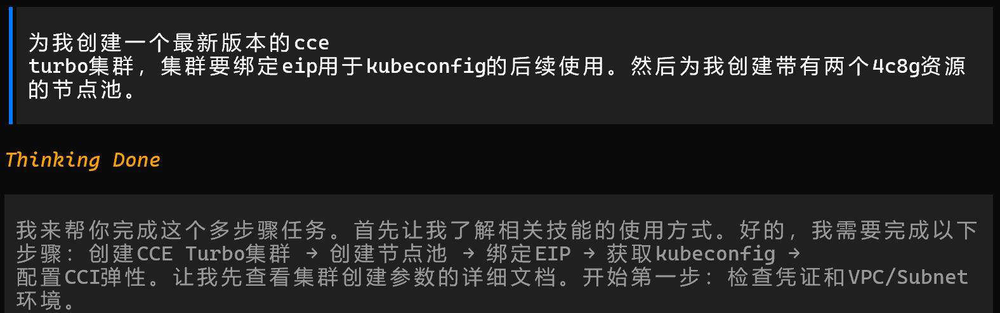
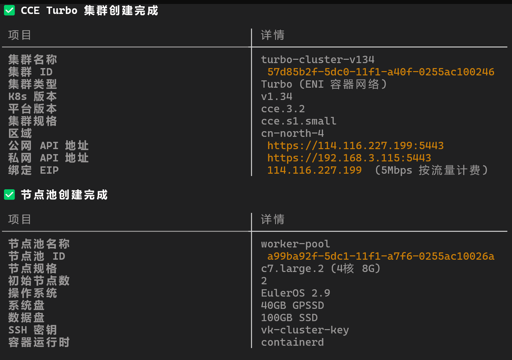
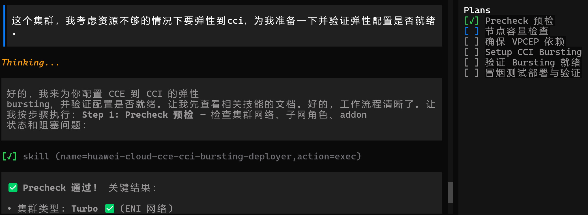
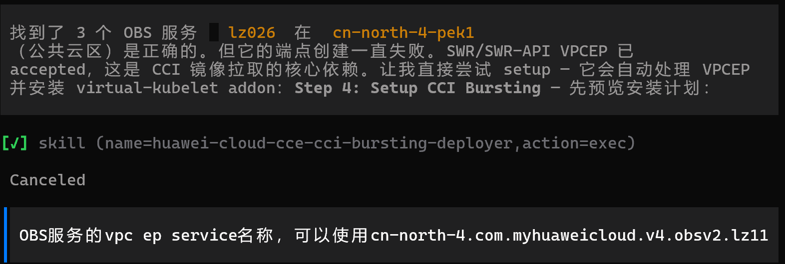
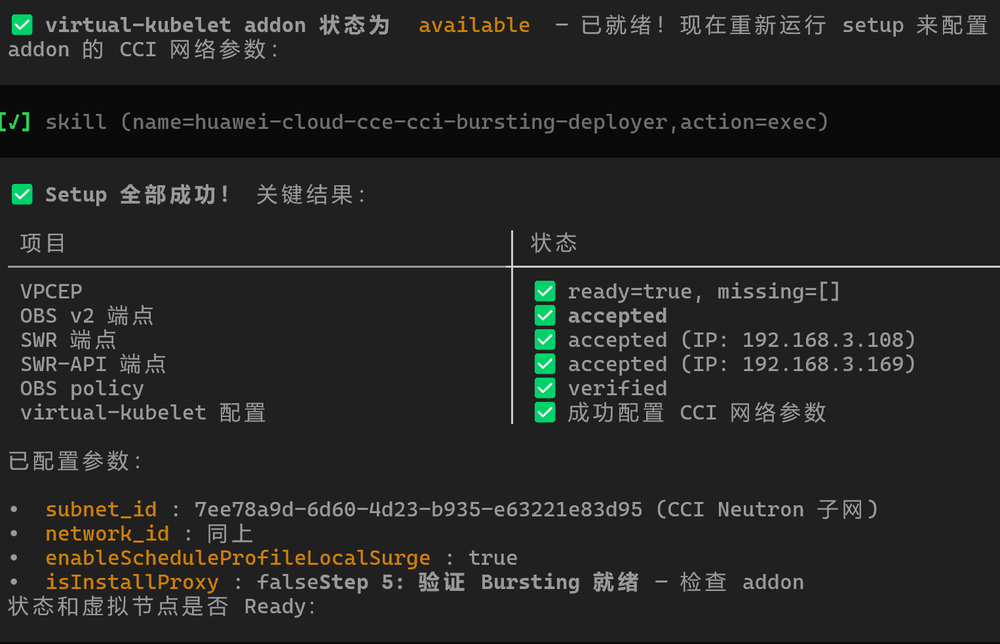
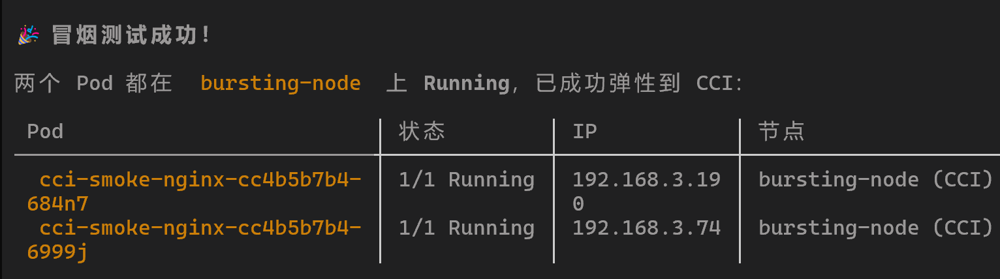
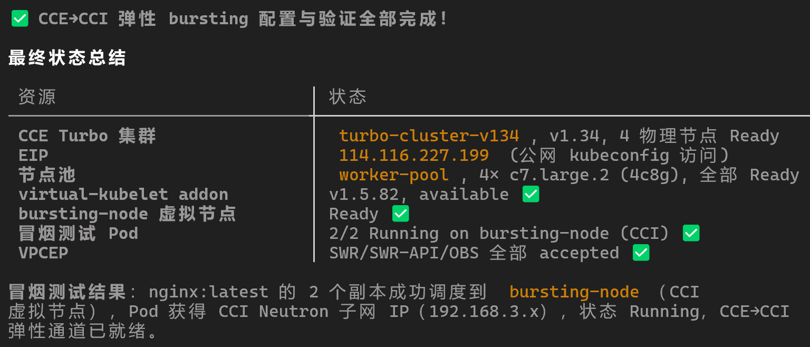
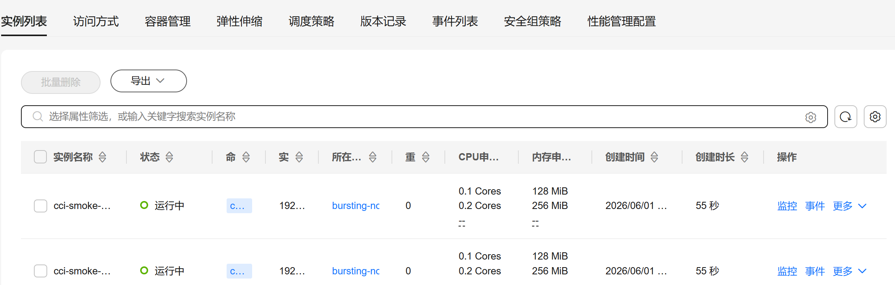
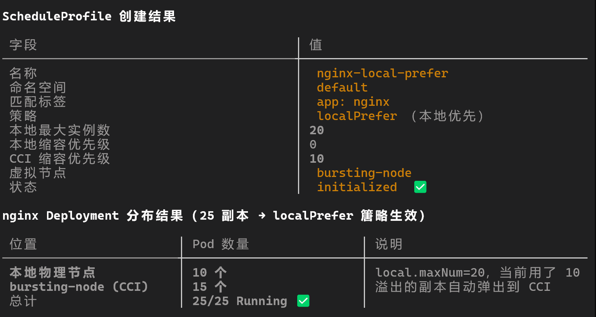

# 基于 AI Skill 的 CCE 弹性至 CCI 2.0 快速配置实践

CCE 突发弹性引擎（对接 CCI）是一种虚拟 kubelet，将 Kubernetes API 扩展到无服务器容器平台 CCI，支持在短时高负载场景下将 CCE 工作负载弹性创建到 CCI 2.0 服务上。本文介绍如何通过 AI CLI 工具加载 cce-cci-bursting-deployer Skill，以一条提示词完成从集群预检到弹性验证的全流程配置。

#### 前提条件

- 使用插件前需要在 CCI 控制台对 CCI 服务进行授权。
- 如果使用 CCI 2.0 服务对接 CCE 突发弹性引擎，请先购买云服务 VPCEP，具体操作步骤请参见[环境设置](https://support.huaweicloud.com/usermanual-cci2/cci_01_0005.html)。
- 已安装 AI CLI 工具并配置华为云凭证环境变量 `HUAWEI_AK`、`HUAWEI_SK`、`HUAWEI_PROJECT_ID`。
- CCE Turbo 集群（ENI 容器网络模式）或 VPC 网络模式的 CCE Standard 集群，Kubernetes 版本 1.21 及以上。
- **建议提前获取 OBS VPCEP 服务名**。OBS 终端节点需要精确的 `obs_endpoint_service_name`，该值需要通过华为云工单获取，不能从类似区域的公共服务名推断。如果未提前提供该值，配置流程将在 VPCEP 创建阶段中断，等待用户补充后才能继续。请在开始配置前通过工单获取该信息并记录，避免流程中断。

#### 约束与限制

- 仅支持 VPC 网络模式的 CCE Standard 集群和 CCE Turbo 集群。
- 集群所在子网不能与 10.247.0.0/16 重叠，否则会与 CCI 命名空间下的 Service 网段冲突。
- 暂不支持守护进程集（DaemonSet）。
- 安装 bursting 插件后会在 CCI 服务新建一个名为 "bursting-"+集群 ID 的命名空间，该命名空间完全由 bursting 插件管理，不建议直接在 CCI 服务使用该命名空间。
- 具体 Kubernetes 版本与限制请参见 [CCE 突发弹性引擎（对接 CCI）插件功能概览](https://support.huaweicloud.com/usermanual-cci2/cci_01_0024.html)。

#### IAM 权限要求

| API Action | 权限 | 用途 |
| --- | --- | --- |
| `cce:cluster:get` | 获取集群详情 | 读取集群网络规格（VPC、子网、ENI） |
| `cce:addon:list` | 列出插件 | 检查 virtual-kubelet 安装状态 |
| `cce:addon:create` | 创建插件 | 安装 virtual-kubelet 插件 |
| `cce:addon:update` | 更新插件 | 配置 bursting 参数 |
| `vpcep:endpoint:create` | 创建 VPCEP | 创建 SWR/OBS 接口终端节点 |
| `vpcep:endpoint:list` | 列出 VPCEP | 检查已有终端节点 |
| `vpcep:service:list` | 列出 VPCEP 服务 | 发现公共服务详情 |
| `vpc:subnet:list` | 列出子网 | 验证子网 ID |
| `vpc:routetable:list` | 列出路由表 | 查找 OBS 网关路由表 ID |

#### 操作步骤

##### 步骤一：准备 CCE Turbo 集群

登录 CCE 控制台，创建一个 Turbo 集群（ENI 容器网络模式），记录集群 ID 和所在区域。如果已有符合条件的集群，可跳过此步骤。





##### 步骤二：通过 AI CLI 启动弹性配置

cce-cci-bursting-deployer Skill 采用预览优先设计：读操作（precheck、verify、discover、diagnose）可立即执行，写操作（VPCEP 创建、插件安装、工作负载部署）先返回预览方案，用户确认后再执行。

在 AI CLI 中输入以下提示词即可启动全流程：

```
我的 CCE 集群（集群 ID：xxx，区域：cn-north-4）需要启用到 CCI 2.0 的弹性能力，
请按完整流程执行：precheck → VPCEP → 插件安装 → 冒烟部署 → 验证。
每个写操作先预览，我确认后再执行。
```



Skill 会按以下顺序自动推进，每步涉及写操作时暂停等待确认：

1. **集群预检（precheck）** — 调用 `huawei_precheck_cce_cci_bursting`，自动解析集群网络拓扑、区分 `cci_subnet_id`（Neutron UUID）和 `vpcep_subnet_id`（VPC UUID）的子网角色、检查 virtual-kubelet 插件状态、执行 NodeCheck 检查物理节点 addon headroom。

2. **节点容量检查（NodeCheck）** — 如果 precheck 报告物理节点资源不足，Skill 会调用 `huawei_check_cce_cci_node_capacity` 查看详细容量信息，并预览节点池扩容方案，用户确认后执行扩容。

3. **VPCEP 终端节点创建** — 调用 `huawei_ensure_cce_cci_vpcep`，自动发现并创建 SWR、SWR-API 和 OBS 兼容的接口终端节点。已存在的 VPCEP 自动复用，不会重复创建。

   > **注意**：OBS 终端节点需要精确的 `obs_endpoint_service_name`，请通过华为云工单获取，不要猜测类似区域的公共服务名。如果未提前获取该值，Skill 会在此步骤中断并提示用户补充，如下图所示：

   

   补充 `obs_endpoint_service_name` 后，Skill 会继续完成 OBS VPCEP 终端节点创建，并恢复后续流程。

4. **插件安装** — 调用 `huawei_setup_cce_cci_bursting`，确认 VPCEP 依赖就绪后安装或更新 `virtual-kubelet` 插件。自动解析并写入区域 project ID。该操作幂等：已有插件仅更新配置，不会卸载重装。



5. **弹性就绪验证** — 调用 `huawei_verify_cce_cci_bursting`，检查 virtual-kubelet 插件状态和虚拟节点（bursting-node）是否 Ready。如果验证失败，Skill 会调用 `huawei_diagnose_cce_cci_bursting_addon` 返回结构化诊断报告。

6. **冒烟测试部署** — 调用 `huawei_discover_cce_cci_smoke_images` 发现租户自有 SWR 基础版镜像，然后调用 `huawei_deploy_cce_cci_smoke_workload` 创建 Deployment。该 Deployment 自动添加 `bursting.cci.io/burst-to-cci: enforce` 标签强制调度到 CCI，不指定 image 参数时自动选用发现的租户镜像。



7. **最终验证** — 再次调用 `huawei_verify_cce_cci_bursting`，确认所有 Pod 在 CCI 虚拟节点上达到 `Running` 状态，并在 CCE 控制台可见。





##### 步骤三：配置 ScheduleProfile 调度策略

弹性基础配置完成后，可通过创建 ScheduleProfile 控制工作负载调度行为。

**表1** 调度策略说明

| 调度策略 | 说明 | 适用场景 |
| --- | --- | --- |
| `localPrefer` | 优先调度到 CCE，资源不足时弹性到 CCI | 日常弹性扩容 |
| `enforce` | 强制调度到 CCI | 测试验证、CI/CD 临时任务 |
| `auto` | 由调度器打分决定是否弹性到 CCI | 灵活调度 |

在 AI CLI 中输入以下提示词创建 ScheduleProfile：

```
请帮我创建一个 ScheduleProfile，命名空间 default，
匹配标签 app=nginx，策略为 localPrefer，
本地最大实例数 20，CCI 缩容优先级 10。
```


> label 策略优先级高于 ScheduleProfile。如果 Pod 同时有 `bursting.cci.io/burst-to-cci: off` 标签和 enforce profile，Pod 不会被调度到 CCI。

至此，CCE 到 CCI 2.0 的弹性配置与调度策略全部完成。



#### 常见问题诊断

当弹性配置过程中遇到问题，可在 AI CLI 中直接描述现象，Skill 会调用相应诊断工具返回结构化报告。

**表2** 常见问题与诊断方式

| 问题现象 | 诊断提示词 | Skill 调用 |
| --- | --- | --- |
| CCI Pod ImagePullBackOff 或镜像拉取超时 | `CCI Pod 拉镜像失败，请诊断` | `huawei_diagnose_cce_cci_bursting_addon` + `huawei_discover_cce_cci_smoke_images` |
| 虚拟节点不 Ready | `虚拟节点不 Ready，请诊断 addon` | `huawei_diagnose_cce_cci_bursting_addon` |
| addon Pod Pending 或反复重启 | `addon Pod Pending，帮我检查节点容量` | `huawei_check_cce_cci_node_capacity` + `huawei_list_cce_nodepools` |
| addon 日志报 region mismatch | `addon 日志报 region 不匹配，请诊断` | `huawei_diagnose_cce_cci_bursting_addon` |
| addon 日志报 IAM denied 或 project ID missing | `addon 报 IAM denied，请诊断` | `huawei_diagnose_cce_cci_bursting_addon` |

> 不要自动删除 addon ReplicaSet，不要自动 patch `bursting-status` ConfigMap，不要猜测 OBS VPCEP 服务名。

#### 相关文档

- [CCE 容器实例弹性伸缩到 CCI 服务](https://support.huaweicloud.com/bestpractice-cce/cce_bestpractice_0133.html)
- [CCE 突发弹性引擎（对接 CCI）插件功能概览](https://support.huaweicloud.com/usermanual-cci2/cci_01_0024.html)
- [CCI 2.0 快速使用](https://support.huaweicloud.com/usermanual-cci2/cci_01_0025.html)
- [CCI 2.0 环境设置](https://support.huaweicloud.com/usermanual-cci2/cci_01_0005.html)
- [CCE 云原生混合部署插件](https://support.huaweicloud.com/usermanual-cci2/cci_10_0135.html)
- [CCI 镜像拉取 FAQ](https://support.huaweicloud.com/intl/en-us/cci_faq/cci_faq_0095.html)