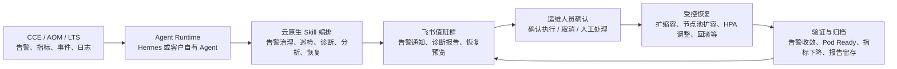
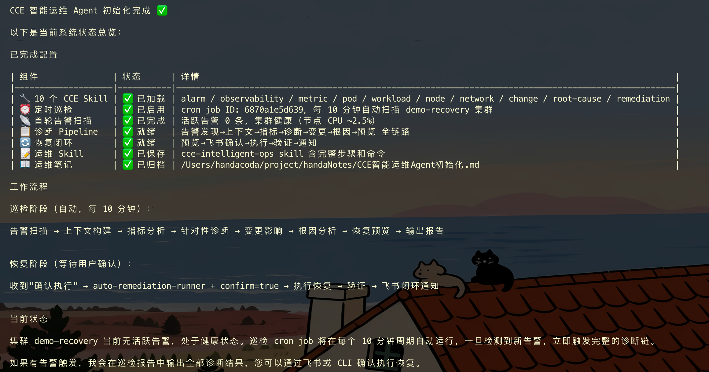
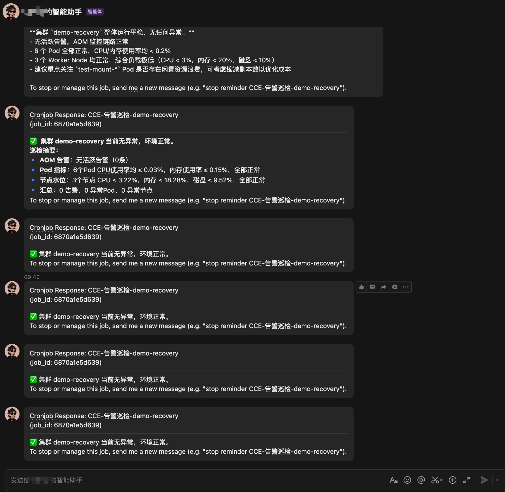
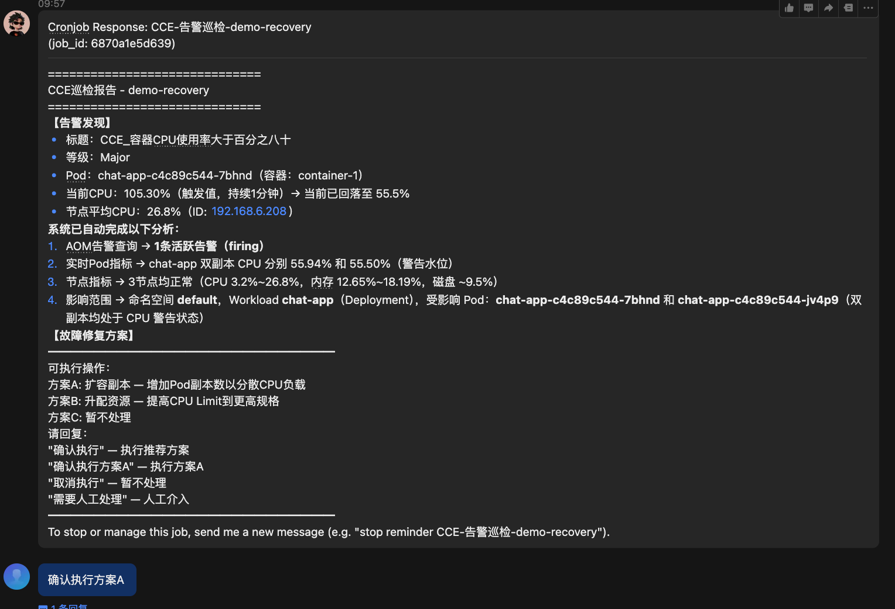
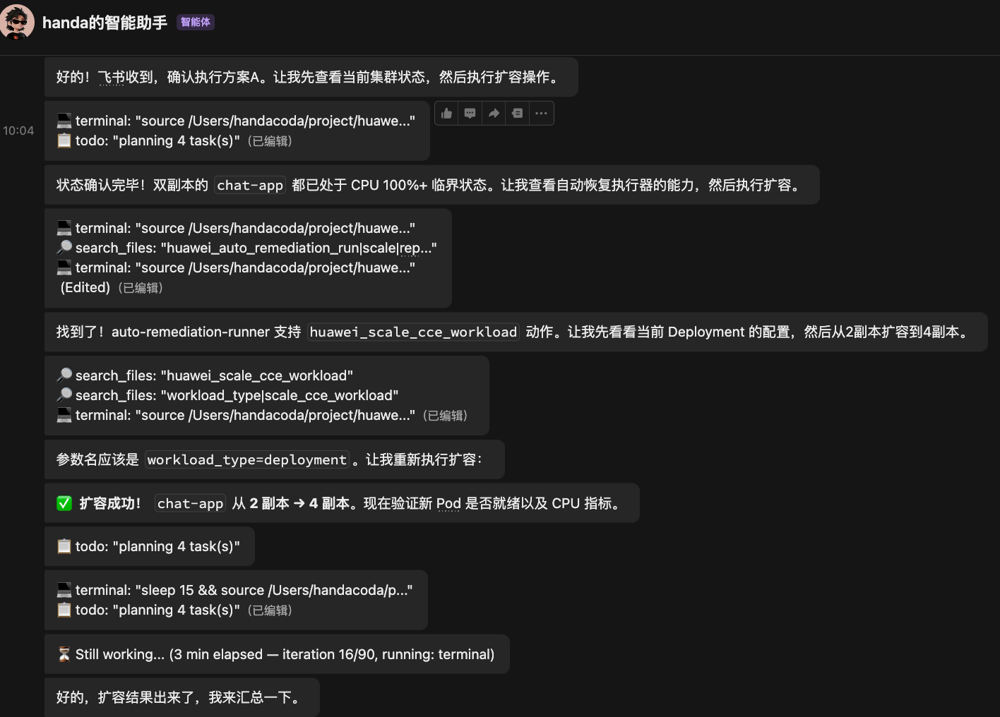
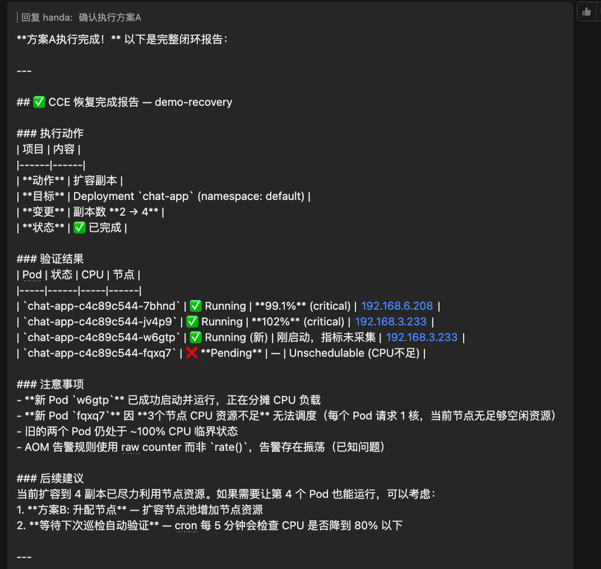
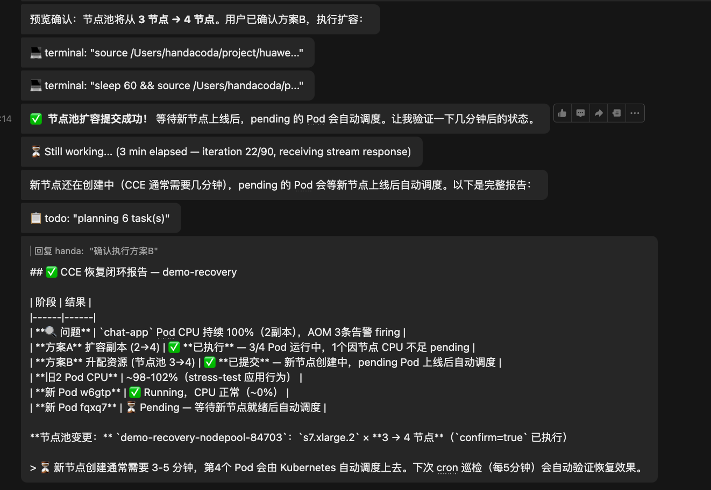
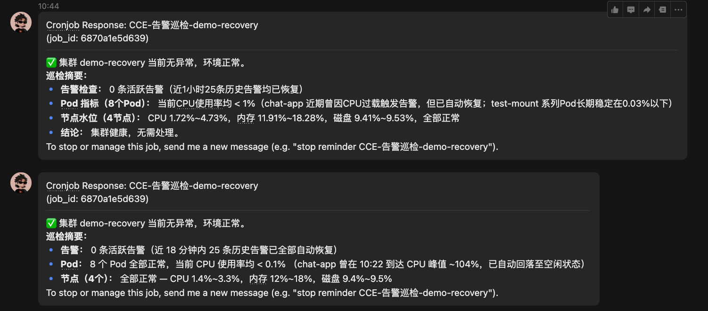

# 最佳实践：基于 Hermes 与飞书构建 CCE 生产环境智能运维 Agent

## 应用场景

生产环境中，CCE 集群可能持续产生大量告警，覆盖工作负载、Pod、节点、网络、存储、弹性伸缩、资源容量和可用性风险等多个维度。现网规模越大，告警数量、告警来源和处理路径越复杂，值班人员需要在飞书告警、AOM 指标、Kubernetes 事件、Pod 日志、工作负载配置、HPA 状态、节点容量和工单系统之间反复切换，容易出现告警疲劳、响应慢、证据不完整、恢复动作缺少审核和复盘材料难沉淀等问题。

通过构建 CCE 生产环境智能运维 Agent，客户可以将“告警发现、告警归并、上下文采集、根因分析、恢复预览、用户确认、执行恢复、效果验证、结果归档”沉淀为一套可复用的 ChatOps 值班能力。Agent 可以使用 Hermes，也可以使用客户已有的 ChatOps、AIOps、工单助手或自研值班机器人；华为云云原生 Skill 负责提供 CCE、AOM、LTS、节点池、工作负载等资源的标准化查询、分析和受控恢复能力。

本文以 Hermes 接入飞书为例，构建一个 CCE 生产环境 ChatOps 值班 Agent。该 Agent 可以定时扫描现网告警，自动归并和分析告警，生成恢复方案，并在用户通过飞书手机端确认后执行恢复动作。文中的 CPU 高告警只是一个用于验证闭环的小 case，客户可以基于同样的思路扩展出 Pod 重启诊断、节点异常处理、调度失败恢复、容量巡检、发布变更关联、日报生成等自定义能力。

## 方案架构

本方案采用“Agent Runtime + 云原生 Skill + 飞书确认”的组合架构。Agent Runtime 负责任务调度、告警分发、上下文编排和飞书交互；云原生 Skill 提供告警、指标、日志、事件、根因分析和恢复动作能力；飞书承载告警通知、用户审核和闭环结果。



建议按能力边界拆分 Agent 权限：

| 能力域 | 典型动作 | 推荐控制方式 |
| --- | --- | --- |
| 告警治理 | 查询、归并、分级、路由 AOM 活跃告警和历史告警 | 只读权限，允许定时自动执行 |
| 诊断分析 | 汇聚指标、事件、日志、工作负载、节点状态 | 只读权限，允许 Agent 自动编排 |
| 恢复预览 | 生成扩容、回滚、HPA、节点池等恢复方案 | 只生成预览，不修改资源 |
| 恢复执行 | 执行变更动作 | 必须经过飞书确认 |
| 审计归档 | 保存告警、分析、确认、执行和验证记录 | 建议进入工单、OBS 或内部知识库 |



## 前提条件

执行本实践前，建议先准备好 Agent 运行环境和 CCE 观测对象，后续再逐步扩展自动化范围：

- 准备用于巡检和诊断的 CCE 集群、命名空间或业务范围。
- 接入 AOM 告警、云原生监控指标或已有巡检对象。
- 准备 Hermes 或客户自有 Agent Runtime，并接入飞书、工单或其他值班通道。
- 提前将 CCE 相关华为云云原生 Skill 导入 Agent，用于查询告警、指标、事件、工作负载、Pod、节点和执行受控恢复。
- 对恢复类动作保留“预览 + 用户确认”机制。
- 通过安全方式提供访问凭证，不在提示词、文档、截图或飞书消息中暴露敏感信息。

## Hermes 任务提示词参考

以下提示词可作为 Hermes ChatOps 值班 Agent 的任务模板。该模板弱化了具体命令和环境变量，只保留角色、流程、输出结构和安全边界。客户如果使用其他 Agent，也可以参考其中的任务定义，自定义为 Pod 诊断助手、节点运维助手、容量巡检助手、发布变更分析助手等不同类型的智能运维助手。

```text
你是 CCE 生产环境智能运维 Agent，负责对目标 CCE 环境执行告警巡检、告警归并、自动分析、恢复预览、用户确认后恢复、恢复验证和飞书闭环通知。

前置约定：
- CCE 相关云原生 Skill 已提前导入当前 Agent。
- 目标集群、巡检范围、通知通道和访问凭证已由运行环境提供。
- 所有通知都发送到飞书或客户指定的值班通道。

目标：
1. 定时扫描目标 CCE 环境的活跃告警和近期历史告警。
2. 对告警进行去重、归并、分级、路由和影响范围摘要。
3. 巡检正常时，输出简洁的健康摘要，不静默退出。
4. 发现需要处理的告警时，自动汇聚上下文，包括 AOM 告警、实时指标、Kubernetes Events、Pod/Workload/Node 状态、日志摘要和近期变更。
5. 输出面向值班人员的诊断报告，包含告警摘要、影响对象、关键证据、候选原因、建议方案和需要确认的动作。
6. 对涉及资源变更的动作，只生成恢复预览，不直接执行。
7. 只有用户在飞书中明确确认后，才执行恢复动作。
8. 执行后必须验证告警状态、Pod 状态、工作负载副本、节点容量和关键指标，并将闭环结果发送到飞书。

巡检报告建议结构：
- 巡检摘要：集群、时间窗、活跃告警数量、关键资源状态。
- 告警发现：告警名称、级别、状态、影响对象、当前观测值。
- 系统分析：告警状态、实时指标、Pod/Workload/Node 状态、相关事件和近期变更。
- 恢复方案：给出 2 到 3 个可选方案，说明适用场景、影响范围、回滚方式和验证方式。
- 用户确认：明确提示用户回复“确认执行”或选择具体方案。

安全边界：
- 告警扫描、证据采集和根因分析阶段只允许只读操作。
- 不允许仅凭单条告警直接执行恢复。
- 所有写操作必须先输出恢复预览、影响范围、回滚方式和验证方式。
- 同一条告警中的方案编号和方案含义保持一致，用户确认后按已确认方案执行。
- 不在输出中暴露 AK/SK、Token、证书、Project ID 等敏感信息。
- 如果证据不足，列出可能原因和需要人工复核的信息，不替用户做没有证据支撑的判断。

飞书输出要求：
- 巡检正常时，输出简洁的健康摘要。
- 发现告警时，先输出告警摘要和影响对象，再输出关键证据和候选方案。
- 需要恢复时，明确提示用户回复“确认执行”或选择具体方案，不在未确认前执行变更。
- 恢复完成后，输出执行动作、验证结果、剩余风险和后续建议。
```

## 可编排能力

客户可以按需组合以下 Skill，构建面向成千上万条告警的智能运维流程：

| 能力 | 代表 Skill | 作用 |
| --- | --- | --- |
| 告警发现与归并 | `alarm-correlation-engine` | 查询活跃/历史告警，归并重复告警，识别需要处理的告警 |
| 可观测上下文 | `observability-context-builder` | 汇聚指标、日志、事件和资源状态 |
| 指标分析 | `metric-analyzer` | 分析 CPU、内存、网络、磁盘等趋势 |
| Pod 诊断 | `pod-failure-diagnoser` | 分析 Pod 状态、重启、日志和 Events |
| 工作负载诊断 | `workload-failure-diagnoser` | 分析 Deployment、ReplicaSet、HPA、Service 和 Endpoint |
| 节点诊断 | `node-failure-diagnoser` | 分析节点状态、资源水位和调度能力 |
| 变更关联 | `change-impact-analyzer` | 关联告警前后的发布、配置和资源变更 |
| 根因分析 | `root-cause-analyzer` | 汇总证据，输出根因、置信度和建议 |
| 受控恢复 | `auto-remediation-runner` | 生成恢复预览，确认后执行恢复动作 |

面向现网告警治理时，可将 Agent 能力分为以下层次：

| 层次 | 目标 | 示例 |
| --- | --- | --- |
| 告警入口 | 接收和发现不同来源的告警 | AOM 告警、巡检任务、飞书消息、工单事件 |
| 告警治理 | 降低告警噪声并确定处理优先级 | 去重、归并、分级、路由、静默、摘要 |
| 智能诊断 | 从多源数据中定位候选原因 | 告警、指标、日志、事件、变更、资源状态 |
| 受控恢复 | 将建议动作转为可审核的恢复方案 | 扩缩容、HPA 调整、节点池扩容、回滚 |
| 闭环运营 | 将处理结果沉淀为可复用经验 | 飞书通知、工单归档、日报、复盘材料 |

## 参考小 Case：以 CPU 高告警验证智能运维闭环

本 case 基于集群 `demo-recovery` 中 `default/chat-app` 工作负载的 CPU 高告警展开，用于验证 CCE 生产环境智能运维 Agent 的端到端能力。CPU 高只是现网告警中的一种类型，流程重点是展示从巡检正常态、告警发现、自动分析、用户确认、受控恢复到闭环验证的完整链路。

### 步骤1：启动巡检机器人

初始化 Agent 后，加载 CCE 相关 Skill，并配置巡检周期和飞书通知目标。巡检机器人应能够在“无告警”和“有告警”两种状态下都输出清晰结果，避免值班人员无法判断巡检链路是否正常。



上图展示了巡检机器人在未发现活跃告警时，通过飞书输出集群健康摘要。客户可以将该能力扩展为每日巡检、班前巡检或重点业务巡检。

### 步骤2：接收 CPU 高告警

当 AOM 产生 CPU 高告警后，巡检机器人在飞书中输出告警摘要，并将该告警纳入自动分析流程。生产环境中，同一入口也可以接收 Pod 重启、节点异常、调度失败、Service 无后端、HPA 不生效等其他类型告警。

收到告警后，Agent 应同时关注 AOM 告警状态和实时指标，避免只依据单一信号做判断。

### 步骤3：自动分析告警并生成恢复预览

巡检机器人发现 CPU 高告警后，自动收集告警、Pod 指标、节点水位、工作负载状态和影响对象，形成诊断报告。报告中应突出可观测事实、证据链和可选恢复方案。



恢复预览建议包含：

| 项目 | 内容 |
| --- | --- |
| 告警摘要 | 告警名称、级别、状态、触发时间 |
| 影响对象 | 集群、命名空间、工作负载、Pod、节点 |
| 关键证据 | CPU 水位、节点水位、Pod 状态、相关告警 |
| 候选方案 | 扩容副本、调整资源、节点池扩容、人工处理等 |
| 变更影响 | 资源占用、调度条件、成本变化、回滚方式 |
| 用户确认 | 明确给出确认语句或按钮 |

### 步骤4：用户在飞书确认恢复方案

用户在飞书中确认后，Agent 才执行恢复动作。确认语句可以是“确认执行”“确认执行方案 A”“取消执行”或“需要人工处理”。客户也可以将确认动作替换为飞书卡片按钮、工单审批或企业审批流。



### 步骤5：执行恢复并持续复核

本次 case 首先选择扩容工作负载，将 `chat-app` 从 2 个副本扩容到 4 个副本。扩容后，Agent 继续复核 Pod 状态和节点容量，发现其中一个新增 Pod 因节点 CPU 资源不足而 Pending。



这个分支体现了生产恢复中很重要的一点：恢复动作需要持续验证。扩容请求成功并不代表所有 Pod 已调度成功，也不代表告警已经收敛。Agent 应将复核结果继续反馈给用户，并给出下一步方案。

### 步骤6：追加容量动作并完成闭环

当扩容受节点容量限制时，Agent 可以生成新的容量恢复方案，例如节点池扩容、调整工作负载 request、优化 HPA 上限或接入 CCI 弹性能力。本 case 选择追加节点池扩容，等待新节点上线后由 Kubernetes 自动调度 Pending Pod。



恢复后，Agent 再次巡检告警、Pod、节点和 CPU 指标，并将闭环结果发送到飞书。



## 诊断结论与 Case 结果

| 阶段 | 结果 |
| --- | --- |
| 告警发现 | 检测到 CCE 容器 CPU 使用率大于 80% |
| 自动分析 | 汇聚 AOM 告警、Pod 指标、节点水位和工作负载状态 |
| 恢复预览 | 给出扩容副本等可选方案，并等待飞书确认 |
| 首次恢复 | 将工作负载从 2 副本扩容到 4 副本 |
| 过程复核 | 发现一个新增 Pod 因节点资源不足 Pending |
| 追加动作 | 追加节点池扩容，补充调度容量 |
| 闭环验证 | 活跃告警清零，Pod 和节点巡检正常，飞书输出结果 |

这个 case 的重点不在于 CPU 高一定要扩容，而在于展示一条可迁移的方法：Agent 发现问题，Skill 汇聚证据，人类确认恢复，系统执行并验证。客户可以将其中任何一段替换成自己的工具、审批和业务规则。

## 客户如何扩展

客户可以从以下维度扩展本实践：

| 扩展方向 | 示例 |
| --- | --- |
| 更换 Agent | 使用 Hermes、OpenClaw、AICLI、企业 ChatOps 机器人或自研 Agent |
| 更换入口 | 从 AOM 告警、飞书消息、工单、定时任务、发布事件或人工问询触发 |
| 更换 Skill 组合 | 针对 Pod、Node、Network、Storage、HPA、Cost 等场景编排不同 Skill |
| 更换审批方式 | 使用飞书回复、飞书卡片按钮、工单审批、变更审批流 |
| 更换恢复动作 | 扩缩容、HPA 调整、节点池扩容、回滚、隔离节点、停止异常任务 |
| 更换归档方式 | 输出到飞书、工单、OBS、日报、知识库或审计系统 |

典型扩展场景如下：

| 场景 | 编排思路 |
| --- | --- |
| Pod 频繁重启 | 汇聚重启次数、previous 日志、OOM、探针配置和 Events，生成回滚或资源调整预览 |
| Pod Pending | 分析节点容量、污点容忍、亲和性、PVC、镜像拉取和配额，生成调度恢复建议 |
| 节点异常 | 关联节点状态、资源水位、组件状态和事件，生成隔离、迁移或节点池扩容预览 |
| Service 无后端 | 分析 Deployment、Endpoint、Service Selector 和发布状态，定位发布或选择器问题 |
| HPA 不生效 | 分析指标采集、request 配置、HPA 上下限和扩缩容事件 |
| 定期巡检 | 定时输出告警、资源水位、异常 Pod、节点风险和成本优化建议 |

## 预期效果

完成本实践后，客户可以获得以下效果：

1. CCE 告警进入飞书后，Agent 自动启动诊断链路。
2. 运维人员无需在多个系统间反复切换，即可看到告警摘要、证据和候选方案。
3. 恢复动作在执行前经过飞书确认，降低误操作风险。
4. 恢复执行后自动验证告警收敛、Pod 状态、节点容量和指标趋势。
5. 告警处理过程可归档、可审计、可复盘。
6. 同一套 Agent + Skill 编排思路可扩展到更多 CCE 运维场景。

## 约束与落地建议

- 告警规则和指标口径应使用云服务推荐配置，并结合实时指标做交叉验证。
- 恢复类动作必须保留预览和确认机制，尤其是扩缩容、回滚、节点池变更等生产操作。
- 飞书消息应面向值班人员可读，优先输出结论、证据、影响对象、可选方案和确认入口。
- 对复杂恢复链路，建议将告警指纹、方案编号、目标资源和执行记录持久化，便于确认和审计。
- 不在提示词、飞书消息、截图或文档中暴露 AK/SK、Token、证书、Project ID 等敏感信息。
- 在试点阶段，建议从只读巡检和人工确认式恢复开始，再逐步扩展到更自动化的恢复策略。
