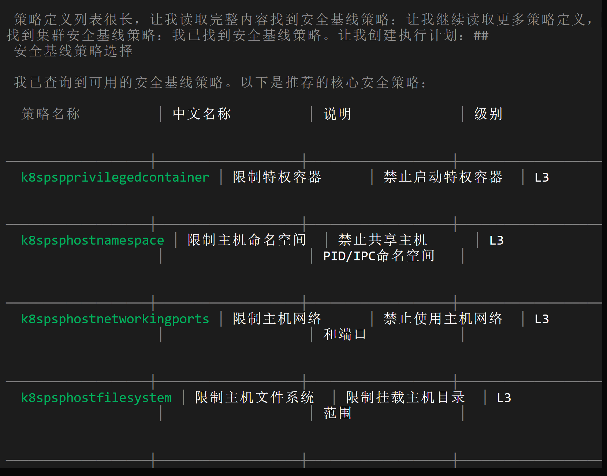
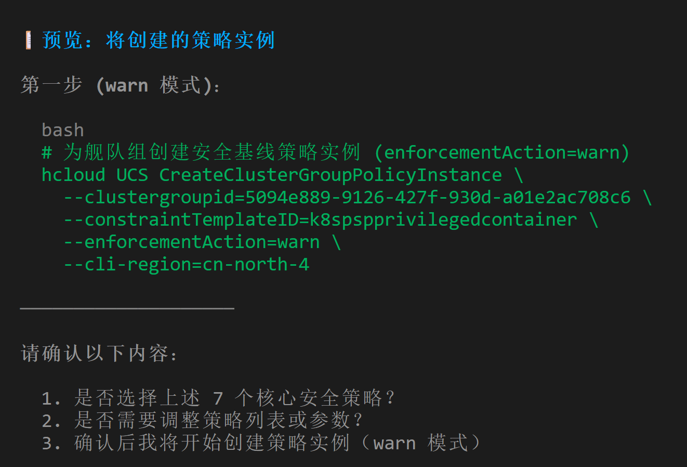
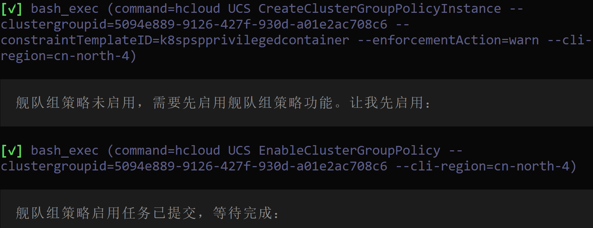
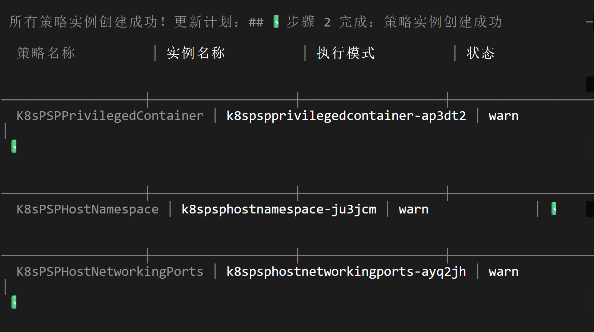
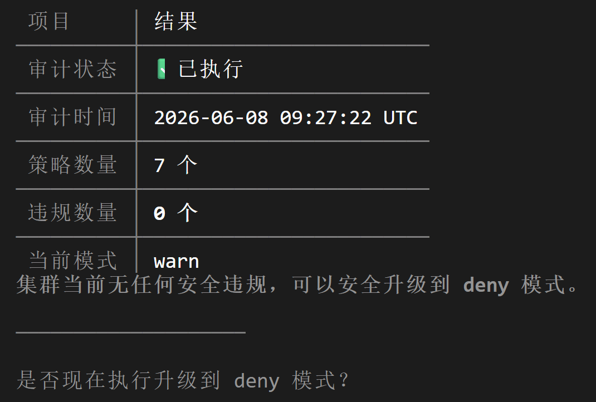
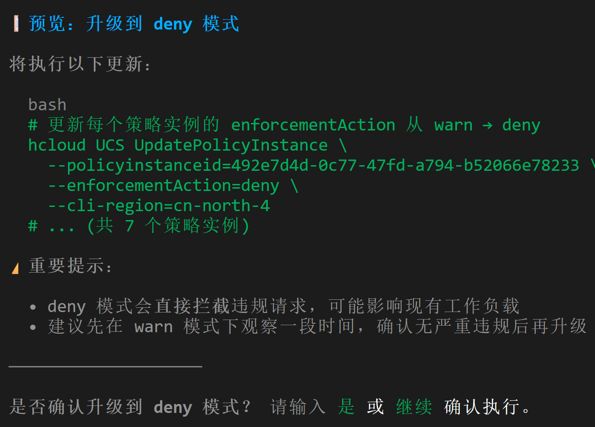
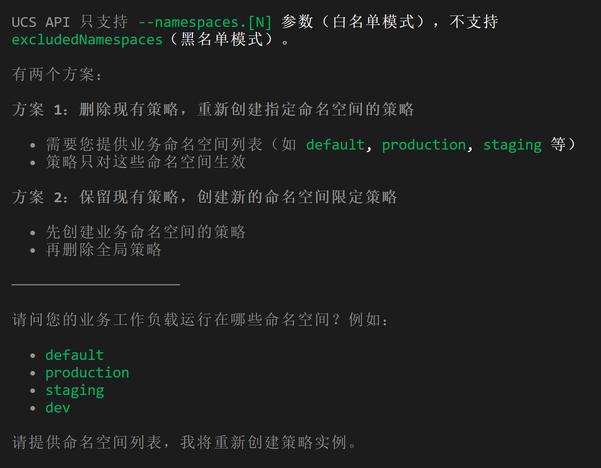
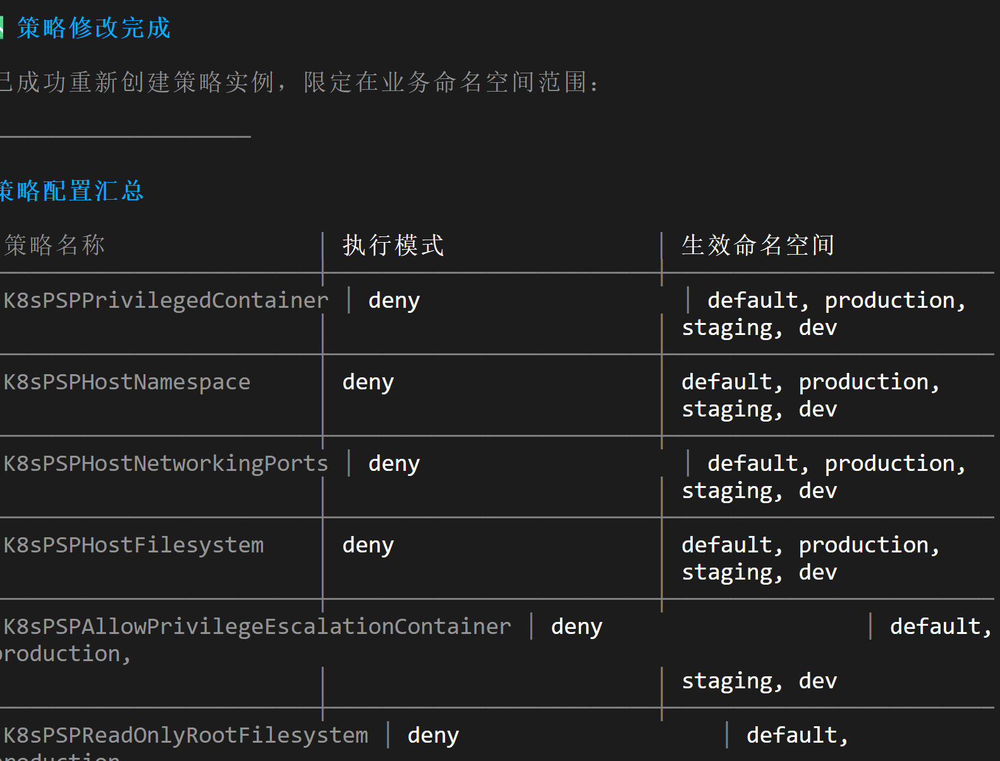

# 基于 AI Skill 的 UCS 多集群舰队策略治理合规最佳实践

UCS（华为云 UCS）多集群舰队管理服务提供舰队级的集群纳管和分类分组能力，通过策略实例实现一致的合规治理。 本文介绍如何通过 AI CLI 工具加载 `huawei-cloud-ucs-policy-governor` Skill，以一条提示词完成从发现策略定义到创建舰队组策略实例、启用策略执行、合规审计、逐步升级为 deny 的端到端治理完整流程。

#### 前提条件

- 已安装 AI CLI 工具并配置华为云凭证环境变量 `HUAWEI_CLOUD_AK`、`HUAWEI_CLOUD_SK`、`HUAWEI_CLOUD_REGION`。
- 已安装 hcloud CLI（版本 >= 7.2.2），首次使用需执行 `printf "y\n" | hcloud version` 接受隐私声明。
- CCE 集群或自管理 Kubernetes 集群已纳管到 UCS，且已加入舰队组。**本文的操作步骤假设读者已经拥有一个或多个已纳管到 UCS 的 CCE 集群或自管理集群，并已通过 UCS 控制台完成了集群纳管和舰队分组。** 如果尚未完成，请先使用 `huawei-cloud-ucs-cluster-onboarding-manager` Skill 集群纳管到 UCS，参考[集群纳管](https://support.huaweicloud.com/productdesc-ucs/ucs_01_0001.html)和[舰队分组](https://support.huaweicloud.com/productdesc-ucs/ucs_01_0301.html)。
- `huawei-cloud-ucs-policy-governor` Skill 采用预览优先设计：读操作（查询策略定义、查看执行状态）可立即执行，写操作（创建策略实例、启用策略执行、禁用策略）先返回预览方案，用户确认后再执行。

#### IAM 权限要求

| API Action | 权限 | 用途 |
| --- | --- | --- |
| `ucs:clusterPolicyInstance:create` | 创建策略 | 创建集群级策略实例 |
| `ucs:clusterGroupPolicyInstance:create` | 创建策略 | 创建舰队组级策略实例 |
| `ucs:policyInstance:update` | 更新策略 | 修改策略实例配置 |
| `ucs:policyInstance:get` | 获取策略 | 查看策略实例详情 |
| `ucs:policyInstance:delete` | 删除策略 | 删除策略实例 |
| `ucs:policyInstance:list` | 列出策略 | 列出所有策略实例 |
| `ucs:policyDefinition:list` | 列出定义 | 列出可用策略定义 |
| `ucs:policyDefinition:get` | 获取定义 | 查看策略定义详情 |
| `ucs:clusterPolicy:enable` | 启用策略 | 启用集群级策略执行 |
| `ucs:clusterPolicy:disable` | 禁用策略 | 禁用集群级策略执行 |
| `ucs:clusterGroupPolicy:enable` | 启用策略 | 启用舰队组级策略执行 |
| `ucs:clusterGroupPolicy:disable` | 禁用策略 | 禁用舰队组级策略执行 |
| `ucs:policyJob:list` | 列出任务 | 列出策略执行任务 |
| `ucs:policyJob:get` | 获取任务 | 查看策略执行任务详情 |

#### 操作步骤

##### 步骤一：发现策略定义

创建策略实例前,需要先了解可用的策略定义,找到合适的 `constraintTemplateID`。

在 AI CLI 中输入以下提示词即可开始:

```
我的集群已纳管到 UCS，请帮我为生产舰队组创建一个安全基线策略实例，
先启用策略执行，从 warn 逐步升级到 deny，
每个写操作先预览，我确认后再执行。
```

Skill 首先会调用 `ListPolicyDefinitions`, 返回所有可用的策略定义列表。策略定义按类别分为:

- **集群安全策略**（ClusterSecurityPolicies）：安全基线、Pod 安全标准、特权容器限制
- **合规策略**：CIS 基准、合规审计、监管合规
- **资源策略**：资源配额、资源限制、成本优化
- **网络策略**：网络策略、入站/出站限制、服务网格规则



用户从中选择合适的策略定义,记录其 `constraintTemplateID`(取 `metadata.name` 字段值,不是 `metadata.uid`)。Skill 同时会评估集群纳管状态和舰队组归属情况,确认策略执行风险。

##### 步骤二：创建舰队组策略实例

确认策略定义后, Skill 调用 `CreateClusterGroupPolicyInstance` 在舰队组上创建策略实例,设置 `enforcementAction=warn`(初始建议使用 warn 模式,违规仅报告不阻止)。

Skill 会预览方案,包含:
- 策略定义名称和作用范围
- 目标舰队组和成员集群列表
- 执行动作(warn)
- 策略参数配置

用户确认后 Skill 才执行创建操作。



> **注意**: 创建策略实例必须使用正确的 scope-specific 操作: 集群级使用 `CreateClusterPolicyInstance`(参数 `--clusterid`), 舰队组级使用 `CreateClusterGroupPolicyInstance`(参数 `--clustergroupid`)。不存在通用的 `CreatePolicyInstance` 操作。

##### 步骤三：启用策略执行

策略实例创建后,需要启用策略执行才能使策略生效。Skill 将调用 `EnableClusterGroupPolicy`,自动启用策略。



> **注意**: 启用策略也必须使用 scope-specific 操作: 集群级使用 `EnableClusterPolicy`(参数 `--clusterid`), 舰队组级使用 `EnableClusterGroupPolicy`(参数 `--clustergroupid`)。不存在通用的 `EnablePolicy` 操作。

##### 步骤四：查看执行任务状态

策略启用后, Skill 调用 `ListPolicyJobs` 查看策略执行任务的状态,调用 `ShowPolicyJob` 查看具体的执行任务详情。

执行任务状态值:
- `Success`: 策略执行部署成功,合规检查已生效
- `InProgress`: 策略执行正在部署中,合规检查待启动
- `Failed`: 策略执行失败,需要查看任务详情定位问题



如果执行任务失败, Skill 会提供诊断建议(如集群未纳管、舰队组无成员、IAM 权限不足等)。

##### 步骤五：合规审计

策略执行成功后,进行合规审计确认舰队整体合规状态。Skill 调用 `ListPolicyInstances` 查看所有策略实例状态,通过 `ListPolicyJobs` 和 `ShowPolicyJob` 查看合规审计结果。



如果发现违规, Skill 会提供修复建议:
1. 查看违规详情,定位受影响的 Kubernetes 资源
2. 通过 `DownloadFederationKubeconfig` 获取集群访问凭证,在集群上修复违规
3. 禁用策略 → 重新启用策略触发新的执行任务
4. 确认新的执行任务状态为 `Success`

##### 步骤六：策略升级 — warn → deny

修复违规并验证合规后,将策略的 `enforcementAction` 从 `warn` 升级为 `deny`:
1. 通过 `UpdatePolicyInstance` 将 `enforcementAction` 更新为 `deny`(需提供 `policyinstanceid`,Skill 会先通过 `ShowPolicyInstance` 查询实例 ID)
2. 重新启用策略验证合规: 先用 `DisableClusterPolicy` 禁用策略,再用 `EnableClusterPolicy --retry=true` 重新启用
3. 再次查看执行任务状态,确认所有策略实例状态为 `Available`,所有执行任务状态为 `Success`



##### 步骤七：配置策略范围

策略创建完成后,可通过策略的命名空间范围和参数配置控制策略的精确行为。

**表1** 作用范围配置方式

| 配置方式 | 说明 | 适用场景 |
| --- | --- | --- |
| 限定命名空间 | 仅在指定命名空间中生效 | 安全基线策略,仅应用于关键命名空间 |
| 全命名空间 | 在所有命名空间生效 | `general` 类型策略的默认行为,通用治理规则 |
| 不指定命名空间 | 由策略定义的 `targetKind` 决定 | `targetKind` 为 Pod 的策略生效在所有 Pod |

在 AI CLI 中输入以下提示词更新策略范围:

```
修改策略范围，排除kube-system等系统命名空间。
```





> `ListPolicyInstances` 和 `ListPolicyDefinitions` 不支持过滤参数,只返回全量数据。如需定位特定策略实例,提供 `policyinstanceid` 让 Skill 使用 `ShowPolicyInstance` 查看详情,再通过 `UpdatePolicyInstance` 更新参数配置。

#### 常见问题诊断

当策略治理过程中遇到问题,可在 AI CLI 中直接描述现象,Skill 会调用相应诊断工具返回结构化报告。

**表2** 常见问题与诊断方式

| 问题现象 | 诊断提示词 |
| --- | --- |
| 策略执行任务一直显示 Failed | `策略执行任务状态显示 Failed，请诊断` |
| 策略实例创建失败 | `创建前先查看策略定义列表，找正确的 constraintTemplateID` |
| 集群未纳管到 UCS | `请先纳管集群再启用策略执行` |
| 舰队组没有成员集群 | `请先向舰队组添加集群` |
| IAM 权限不足 | `报 IAM denied，请在 IAM 控制台创建自定义策略并授权` |
| ListPolicyInstances 结果和预期不符 | `我需要查看策略实例，查看实例 ID` |
| 策略实例已存在冲突 | `报 409 Conflict，查看是否已注册` |
| 策略实例需要更换目标范围 | `想更换策略的作用范围，需要先删除旧的再创建新的` |
| 策略定义列表为空 | `请列出策略定义` |
| 合规审计结果过时 | `请查看舰队合规状态` |

#### 相关文档

- [UCS 介绍](https://support.huaweicloud.com/productdesc-ucs/ucs_01_0001.html)
- [UCS 多集群舰队管理功能概览](https://support.huaweicloud.com/productdesc-ucs/ucs_01_0301.html)
- [UCS 签群治理最佳实践](https://support.huaweicloud.com/bestpractice-ucs/ucs_bestpractice_001/12.html)
- [UCS 签群治理指南](https://support.huaweicloud.com/usermanual-ucs/ucs_01_0003.html)
- [UCS 签群治理策略管理 API 参考](https://support.huaweicloud.com/api-ucs/ucs_02_003/11.html)
- [UCS 舰队管理入门指南](https://support.huaweicloud.com/usermanual-ucs/ucs_02_007.html)
- [UCS 舰队 KubeConfig 使用指南](https://support.huaweicloud.com/usermanual-ucs/ucs_02_008.html)
- [UCS 集群纳管操作指南](https://support.huaweicloud.com/usermanual-ucs/ucs_02_011.html)
- [UCS IAM 权限策略配置](https://support.huaweicloud.com/usermanual-ucs/ucs_02_0003.html)