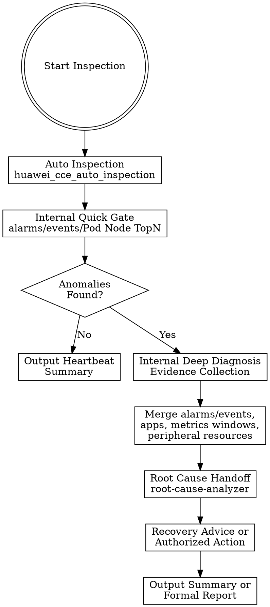

# CCE Daily Cluster Inspector

## Overview

This skill performs periodic, low-risk CCE cluster health inspections. It follows a **quick-check-first** strategy: quick check only answers whether anomalies exist, and deep diagnosis only runs when anomalies are detected. This avoids running heavy diagnostic actions on every inspection cycle.

This skill is **strictly read-only** — it never performs mutation actions. When risks are found, it packages the inspection evidence for `huawei-cloud-cce-root-cause-analyzer` first, then hands root-cause-backed remediation candidates to the appropriate remediation skill.

**Architecture**: `python3 scripts/huawei-cloud.py` dispatcher → Huawei Cloud Python SDK + Kubernetes client → cluster status, Events, metrics, AOM alarms

**Related Skills**:
- `huawei-cloud-cce-auto-remediation-runner` — execute confirmed remediation actions (scale, drain, rollback, etc.)
- `huawei-cloud-cce-root-cause-analyzer` — cross-domain root cause analysis
- `huawei-cloud-cce-pod-failure-diagnoser` — deep Pod failure diagnosis
- `huawei-cloud-cce-node-failure-diagnoser` — deep Node failure diagnosis
- `huawei-cloud-cce-network-failure-diagnoser` — network connectivity, DNS, ELB diagnosis
- `huawei-cloud-cce-alarm-correlation-engine` — alarm correlation and deduplication
- `huawei-cloud-cce-ops-report-generator` — formal operations report generation

## When to Use

- Daily or periodic cluster health check
- Quick heartbeat summary for operational dashboards
- Continuous operations report generation
- Post-change validation (read-only verification after changes made by other skills)
- First-pass triage before escalating to deep diagnosis

**Do NOT use for**:
- Executing remediation actions → use `huawei-cloud-cce-auto-remediation-runner`
- Deep single-resource diagnosis → use domain-specific diagnoser skills
- Capacity forecasting → use `huawei-cloud-cce-capacity-trend-forecaster`

## Prerequisites

### 1. Python Dependencies

- Python 3.8+ with `huaweicloudsdkcce`, `huaweicloudsdkcore`, `kubernetes` packages
- Run environment check before first use

### 2. Credential Configuration

- Valid Huawei Cloud credentials (AK/SK mode)
- **Security Rules**:
  - Never expose AK/SK values in code, conversation, or commands
  - Never use `echo` to check credential values
  - Use environment variables: `HUAWEI_AK`, `HUAWEI_SK`, `HUAWEI_REGION`
  - Prefer IAM users over root account for cloud operations

```bash
export HUAWEI_AK=<your-ak>
export HUAWEI_SK=<your-sk>
export HUAWEI_REGION=cn-north-4
```

### 3. IAM Permission Requirements

| API Action | Permission | Purpose |
|------------|------------|---------|
| `cce:cluster:get` | Get cluster | View CCE cluster details |
| `cce:cluster:createCert` | Create certificate | Obtain kubeconfig for kubectl access |
| `cce:node:list` | List nodes | Query CCE cluster nodes |
| `aom:instance:list` | List AOM instances | Discover AOM Prom instance for metrics |
| `aom:metricsData:get` | Get metrics data | Query Pod/node CPU/memory metrics |
| `aom:alarm:get` | Get alarms | Query AOM alarm history |

## Workflow



**Step-by-step**:

1. Collect region, cluster_id, inspection scope, and report expectations from user
2. Run the combined automation `huawei_cce_auto_inspection` by default. This action internally runs quick check first and triggers deep diagnosis only when anomalies exist.
3. If healthy → output brief heartbeat summary
4. If anomalies found → `huawei_cce_auto_inspection` continues into deep diagnosis. The internal quick gate must only look at AOM alarms, Kubernetes abnormal Events, and Pod/Node monitoring TopN.
5. In internal deep diagnosis, merge alarm groups, analyze abnormal Events and related application objects, collect workload/Pod/Node/Service/Ingress state, summarize abnormal metric time windows, and correlate peripheral resources such as ELB, EIP, and NAT when the signal involves ingress/network resources.
6. After inspection completes with abnormal findings, package region, cluster_id, namespace, target object, time window, symptoms, evidence, severity, impact scope, and data gaps for `huawei-cloud-cce-root-cause-analyzer`
7. Use `huawei-cloud-cce-root-cause-analyzer` first to produce root cause, evidence chain, confidence, impact scope, and remediation hints
8. Pass the root-cause-backed remediation hints to `huawei-cloud-cce-auto-remediation-runner` so it can generate recovery advice, preview actions, or execute only customer-authorized R1 actions
9. Output the inspection summary, root-cause handoff status, and remediation-runner result when that downstream skill is invoked
10. If formal report needed → call `huawei_export_inspection_report`

See `references/workflow.md` for the complete workflow reference.

## Core Tools

All actions dispatched through `scripts/huawei-cloud.py` using `skill action=exec`.

### Quick Check (First Pass)

| Action | Required Parameters | Description |
|--------|---------------------|-------------|
| `huawei_cce_auto_inspection` | region, cluster_id | Default workflow entry: quick check first, then deep diagnosis only when anomalies exist |
| `huawei_cce_quick_check` | region, cluster_id | Manual lightweight anomaly-existence gate when the caller wants to split quick/deep explicitly |

The internal quick gate, exposed as `huawei_cce_quick_check`, is intentionally narrow:
- AOM Critical/Major firing alarms
- Kubernetes Warning/Failed/BackOff/OOM abnormal Events
- Pod CPU/Memory TopN threshold existence check
- Node CPU/Memory/Disk TopN threshold existence check

It must not analyze ELB/EIP/NAT, application root cause, Pod lifecycle details, or Deployment replica mismatches. Those belong to deep diagnosis and root-cause analysis.

### Deep Diagnosis (Escalation)

| Action | Required Parameters | Description |
|--------|---------------------|-------------|
| `huawei_cce_deep_diagnosis` | region, cluster_id | Manual escalation action: collect and organize RCA evidence after quick anomalies |

The internal deep diagnosis path, exposed as `huawei_cce_deep_diagnosis`, collects and organizes read-only evidence:
- Merged AOM alarm groups and quick-check symptom correlation
- Abnormal Event groups with related Pod/Deployment metadata
- Application evidence including Pod states, Deployment replica mismatches, Services, and Ingresses
- Pod/Node monitoring abnormal time windows
- Peripheral ELB/EIP/NAT status and metrics when ingress/network resources are involved
- A root-cause handoff package for `huawei-cloud-cce-root-cause-analyzer`

### Supplemental Inspection Tools

Use these only when a deeper manual report or domain-specific evidence supplement is needed. They are not part of the default quick-to-deep workflow.

| Action | Required Parameters | Description |
|--------|---------------------|-------------|
| `huawei_cce_cluster_inspection_parallel` | region, cluster_id | Parallel multi-domain inspection |
| `huawei_cce_cluster_inspection_subagent` | region, cluster_id | Subagent-based distributed inspection |
| `huawei_pod_status_inspection` | region, cluster_id | Pod health inspection |
| `huawei_node_status_inspection` | region, cluster_id | Node health inspection |
| `huawei_node_resource_inspection` | region, cluster_id | Node resource utilization inspection |
| `huawei_event_inspection` | region, cluster_id | Kubernetes Event analysis |
| `huawei_aom_alarm_inspection` | region, cluster_id | AOM alarm inspection |
| `huawei_elb_monitoring_inspection` | region, cluster_id | ELB health monitoring inspection |

### Aggregation & Reporting

| Action | Required Parameters | Description |
|--------|---------------------|-------------|
| `huawei_aggregate_inspection_results` | region, cluster_id | Aggregate results from parallel/subagent inspections |
| `huawei_export_inspection_report` | region, cluster_id | Export formal inspection report |

## Parameter Reference

| Parameter | Required | Description | Default |
|-----------|----------|-------------|---------|
| `region` | Yes | Huawei Cloud region, e.g., cn-north-4 | `HUAWEI_REGION` |
| `cluster_id` | Yes | CCE cluster ID | N/A |
| `namespace` | No | Kubernetes namespace scope | All namespaces |
| `ak` | No | Override AK | `HUAWEI_AK` |
| `sk` | No | Override SK | `HUAWEI_SK` |
| `project_id` | No | Project ID | Auto from IAM |

## Output Format

See `references/output-schema.md` for the complete JSON response structure.

**Key output fields**:
- `summary` — daily inspection summary text
- `status` — `HEALTHY`, `WARNING`, or `CRITICAL`
- `cluster.region` / `cluster.cluster_id` — cluster identification
- `checks` — list of check results
- `risks` — classified risk items (P0/P1/P2)
- `recommended_followups` — root-cause analysis and recovery handoff recommendations
- `report_file` — optional exported report path

## Risk Constraints

This skill operates under strict read-only inspection constraints:

- Only read-only actions allowed — no scaling, deletion, drain, reboot, hibernate, or awake
- Inspection reports must never contain AK/SK, tokens, certificates, or full kubeconfig
- Anomalies must be analyzed by `huawei-cloud-cce-root-cause-analyzer` before remediation is selected
- Recovery advice and any customer-authorized recovery action must be handled by `huawei-cloud-cce-auto-remediation-runner`
- See `references/risk-rules.md` for full risk boundary details

## Verification

1. Run environment check script
2. Call `huawei_cce_auto_inspection` with a test cluster
3. Verify the report contains all expected sections
4. Confirm read-only behavior (no mutation actions)

## Best Practices

1. **Use auto inspection by default** — start with `huawei_cce_auto_inspection`; use `huawei_cce_quick_check` and `huawei_cce_deep_diagnosis` only when the caller wants manual step-by-step control
2. **Classify risks** — label each anomaly as P0 (critical), P1 (warning), or P2 (low) with recommended owner
3. **Analyze root cause before remediation** — after abnormal inspection, use `huawei-cloud-cce-root-cause-analyzer` before selecting recovery advice
4. **Hand off recovery** — never attempt mutation actions directly; use `huawei-cloud-cce-auto-remediation-runner` for recovery advice, preview, or customer-authorized execution
5. **Scope appropriately** — provide `namespace` to reduce noise when targeting specific workloads
6. **Aggregate supplemental parallel results** — when manually using `huawei_cce_cluster_inspection_parallel`, call `huawei_aggregate_inspection_results` to consolidate
7. **Use formal reports for operations reviews** — call `huawei_export_inspection_report` when a persistent report is needed

## Common Pitfalls

| Pitfall | Symptom | Quick Fix |
|---------|---------|-----------|
| Running deep diagnosis every cycle | Slow inspection, wasted resources | Start with quick check; escalate only on anomaly |
| Attempting remediation directly | Skill scope violation | Run `huawei-cloud-cce-root-cause-analyzer` first, then hand recovery to `huawei-cloud-cce-auto-remediation-runner` |
| Missing cluster_id | Action fails immediately | Provide `cluster_id` from `huawei_get_cce_clusters` |
| No AOM Prom instance | Metrics return empty | Verify AOM instance exists; check `aom:instance:list` permission |
| Not aggregating parallel results | Incomplete or fragmented report | Call `huawei_aggregate_inspection_results` after parallel inspection |
| Exposing credentials in report | Security violation | Reports auto-sanitize; never manually include AK/SK or kubeconfig |

## Reference Documents

| Document | Description |
|----------|-------------|
| [Workflow](references/workflow.md) | Quick-check-first escalation workflow and classification |
| [Risk Rules](references/risk-rules.md) | Read-only inspection boundaries and prohibited actions |
| [Output Schema](references/output-schema.md) | JSON response format for inspection results |

## Notes

1. This skill is **read-only** — it inspects and reports, never mutates cluster state
2. AK/SK must never be hardcoded — use environment variables only
3. All actions dispatched through `scripts/huawei-cloud.py` via `skill action=exec`; do not run scripts directly in shell
4. When inspection finds anomalies, first hand evidence to `huawei-cloud-cce-root-cause-analyzer`, then hand root-cause-backed recovery hints to `huawei-cloud-cce-auto-remediation-runner`
5. For deep single-resource diagnosis, delegate to domain-specific diagnoser skills (`huawei-cloud-cce-pod-failure-diagnoser`, `huawei-cloud-cce-node-failure-diagnoser`, etc.)
