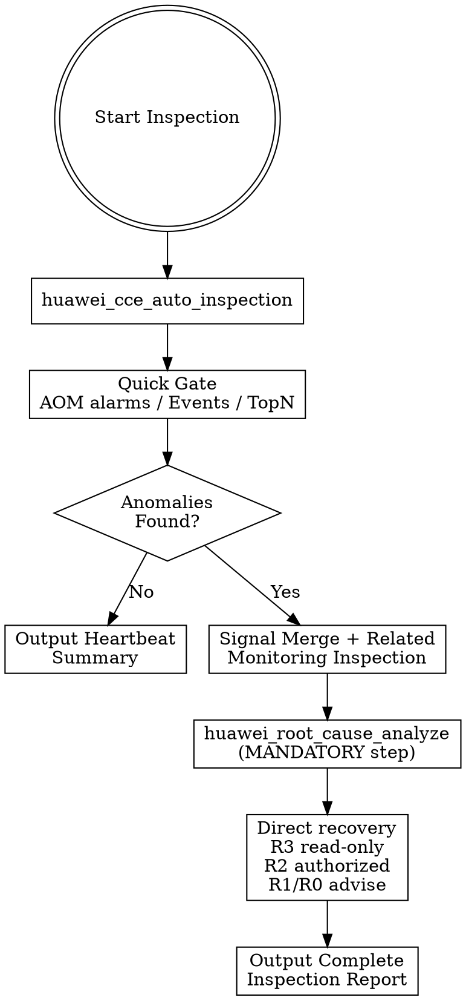

# CCE Daily Cluster Inspector

## Overview

This skill performs periodic CCE cluster health inspections. It follows a **quick-check-first** strategy: quick check only answers whether anomalies exist, and deep diagnosis only runs when anomalies are detected. This avoids running heavy diagnostic actions on every inspection cycle.

The inspection and root-cause evidence collection phases are **read-only**. When risks are found, the skill packages only abnormal inspection findings for `huawei-cloud-cce-root-cause-analyzer`; healthy/normal check items are excluded from RCA handoff. After RCA returns `remediation_candidates`, execute only R3 read-only candidates directly and R2 low-risk candidates when the customer has explicitly authorized automatic recovery for the target scope; for R1/R0, output recommendations and wait for user approval outside this skill.

**Architecture**: `python3 scripts/huawei-cloud.py` dispatcher → Huawei Cloud Python SDK + Kubernetes client → cluster status, Events, metrics, AOM alarms

**Related Skills**:
- `huawei-cloud-cce-root-cause-analyzer` — cross-domain root cause analysis
- `huawei-cloud-cce-pod-failure-diagnoser` — deep Pod failure diagnosis
- `huawei-cloud-cce-node-failure-diagnoser` — deep Node failure diagnosis
- `huawei-cloud-cce-network-failure-diagnoser` — network connectivity, DNS, ELB diagnosis
- `huawei-cloud-cce-alarm-correlation-engine` — alarm correlation and deduplication
- `huawei-cloud-cce-ops-report-generator` — formal operations report generation

## When to Use

- Daily or periodic cluster health check
- Quick heartbeat summary for operational dashboards
- Continuous operations report generation
- Post-change validation (read-only verification after changes made by other skills)
- First-pass triage before escalating to deep diagnosis

**Do NOT use for**:
- Executing R1/R0 or destructive remediation actions without explicit user approval
- Deep single-resource diagnosis → use domain-specific diagnoser skills
- Capacity forecasting → use `huawei-cloud-cce-capacity-trend-forecaster`

## Prerequisites

### 1. Python Dependencies

- Python 3.8+ with `huaweicloudsdkcce`, `huaweicloudsdkcore`, `kubernetes` packages
- Run environment check before first use

### 2. Credential Configuration

- Valid Huawei Cloud credentials (AK/SK mode)
- **Security Rules**:
  - Never expose AK/SK values in code, conversation, or commands
  - Never use `echo` to check credential values
  - Use environment variables: `HUAWEI_AK`, `HUAWEI_SK`, `HUAWEI_REGION`
  - Prefer IAM users over root account for cloud operations

```bash
export HUAWEI_AK=<your-ak>
export HUAWEI_SK=<your-sk>
export HUAWEI_REGION=cn-north-4
```

### 3. IAM Permission Requirements

| API Action | Permission | Purpose |
|------------|------------|---------|
| `cce:cluster:get` | Get cluster | View CCE cluster details |
| `cce:cluster:createCert` | Create certificate | Obtain kubeconfig for kubectl access |
| `cce:node:list` | List nodes | Query CCE cluster nodes |
| `aom:instance:list` | List AOM instances | Discover AOM Prom instance for metrics |
| `aom:metricsData:get` | Get metrics data | Query Pod/node CPU/memory metrics |
| `aom:alarm:get` | Get alarms | Query AOM alarm history |

## Workflow



**⚠️ Agent Execution Contract (Mandatory Chain)**

巡检 Skill 与 Agent 之间有明确的执行契约。**发现异常后，以下两步是强制要求，不可跳过：**

1. **Step 1 → 调用 `huawei_root_cause_analyze`**
   - 使用 `huawei_cce_auto_inspection` 的输出字段 `root_cause_handoff` 作为输入
   - `root_cause_handoff.evidence` 只包含异常项，不包含正常巡检项
   - 目的：获得根因、置信度、证据链、影响面

2. **Step 2 → 直接处理 RCA `remediation_candidates`**
   - 读取 `huawei_root_cause_analyze` 输出的 `remediation_candidates`
   - `risk_level` 为 `R3`：只读候选可直接调用候选中的 `action`，使用候选中的 `params`
   - `risk_level` 为 `R2`：仅在客户已明确授权该集群/命名空间/工作负载/节点的自动恢复范围内执行
   - `risk_level` 为 `R1` 或 `R0`：不执行，只输出恢复建议、影响面、验证方式和需要用户确认的参数

**Step-by-step**:

1. Collect region, cluster_id, inspection scope, and report expectations from user
2. Run `huawei_cce_auto_inspection` by default. This action internally runs quick check first and triggers deep diagnosis only when anomalies exist.
3. If healthy → output brief heartbeat summary → **stop** (no further chain required)
4. If anomalies found → `huawei_cce_auto_inspection` continues into deep inspection.
5. The deep inspection phase merges alarms, Events, Pod/Node TopN, and CoreDNS signals; identifies abnormal objects and related Kubernetes objects; and collects read-only monitoring evidence for involved ELB, EIP, NAT, and ECS resources. It does not infer the final root cause or choose recovery actions. Normal check items remain in the inspection report but are not passed into RCA handoff evidence.
6. After inspection completes with abnormal findings → **MUST call `huawei_root_cause_analyze`** (Step 1 of the mandatory chain)
7. After root-cause analysis completes → process RCA `remediation_candidates` directly: execute R3 read-only candidates, execute R2 low-risk candidates only with customer authorization, and advise only for R1/R0 candidates
8. Output the complete inspection report including: quick check result, deep inspection evidence, root cause analysis result, executed R3/R2-authorized recovery actions, and R1/R0 recovery advice
9. If formal report needed → call `huawei_export_inspection_report`

> **Note**: `huawei_cce_auto_inspection` does NOT automatically call downstream skills — it only packages the root-cause handoff data. The Agent is responsible for calling RCA first, then applying RCA-generated remediation candidates according to the risk policy below. Do not pass the inspector's placeholder `remediation_handoff` as an executable recovery plan.
> RCA handoff note: pass only `root_cause_handoff`, whose `evidence` field has already filtered out healthy/normal inspection items.

**RCA → Remediation Parameter Handoff**

After `huawei_root_cause_analyze` returns, iterate over the RCA output field `remediation_candidates`:

```bash
for candidate in huawei_root_cause_analyze.remediation_candidates:
  if candidate.risk_level == "R3" or (candidate.risk_level == "R2" and customer_authorized_for_target):
    call candidate.action with candidate.params
  else:
    output candidate as advice and ask the user to confirm before any execution
```

Do not call `huawei_auto_remediation_run` from this daily-inspector chain. Also do not convert resource bottleneck cases into rollback-only parameters such as `strategy=rollback_previous_revision namespace=<ns> workload_name=<name>`. For `ApplicationPerformanceOrQuotaBottleneck`, execute the R2 candidates such as `huawei_scale_cce_workload` or `huawei_configure_cce_hpa` directly from RCA candidate params only when customer authorization covers the target scope.

See `references/workflow.md` for the complete workflow reference.

## Core Tools

All actions dispatched through `scripts/huawei-cloud.py` using `skill action=exec`.

### Quick Check (First Pass)

| Action | Required Parameters | Description |
|--------|---------------------|-------------|
| `huawei_cce_auto_inspection` | region, cluster_id | Default workflow entry: quick check first, then deep diagnosis only when anomalies exist |
| `huawei_cce_quick_check` | region, cluster_id | Manual lightweight anomaly-existence gate when the caller wants to split quick/deep explicitly |

Inspection uses one unified time window for alarms and monitoring. Default is the past 6 hours. Override it with one of:
- `inspection_period_minutes=10` for a 10-minute scheduled inspection cycle
- `inspection_period_hours=2` for a 2-hour scheduled inspection cycle
- `inspection_window_minutes` or `inspection_window_hours` when you want to name the query window directly
- `thresholds='{"inspection_period_minutes":10}'` for JSON-based callers

The internal quick gate, exposed as `huawei_cce_quick_check`, is intentionally narrow:
- AOM Critical/Major firing alarms
- Kubernetes Warning/Failed/BackOff/OOM abnormal Events
- Pod CPU/Memory TopN threshold existence check
- Node CPU/Memory/Disk TopN threshold existence check
- CoreDNS CPU usage, Prometheus success rate > 99%, and P99 DNS latency < 100ms existence check

It must not analyze ELB/EIP/NAT, application root cause, Pod lifecycle details, or Deployment replica mismatches.

### Deep Inspection (Escalation)

| Action | Required Parameters | Description |
|--------|---------------------|-------------|
| `huawei_cce_deep_diagnosis` | region, cluster_id | Manual escalation action: merge abnormal signals, identify abnormal objects, and collect related monitoring evidence after quick anomalies |

The internal escalation path, exposed as `huawei_cce_deep_diagnosis`, performs read-only inspection evidence collection:
- Merge AOM alarm signals into compact alarm groups
- Merge Kubernetes abnormal Events by involved object, reason, and time window
- Extract Pod CPU/Memory and Node CPU/Memory/Disk abnormal monitoring windows
- Preserve CoreDNS CPU, success rate, latency, anomalies, and monitoring data gaps
- Build abnormal object evidence for Pod, Node, Workload, Service, Ingress, and Cluster objects
- Map related Service/Ingress/ELB/EIP and node/ECS relationships when the object evidence points to them
- Collect related ELB, EIP, NAT, and ECS monitoring/status evidence when involved
- Produce a root-cause handoff package for `huawei-cloud-cce-root-cause-analyzer`
- Exclude healthy/normal check results from the RCA handoff package; keep them only in the inspection report

It must not conclude the final root cause or select remediation actions.

### Supplemental Inspection Tools

Use these only when a deeper manual report or domain-specific evidence supplement is needed. They are not part of the default quick-to-deep workflow.

| Action | Required Parameters | Description |
|--------|---------------------|-------------|
| `huawei_cce_cluster_inspection_parallel` | region, cluster_id | Parallel multi-domain inspection |
| `huawei_cce_cluster_inspection_subagent` | region, cluster_id | Subagent-based distributed inspection |
| `huawei_pod_status_inspection` | region, cluster_id | Pod health inspection |
| `huawei_node_status_inspection` | region, cluster_id | Node health inspection |
| `huawei_node_resource_inspection` | region, cluster_id | Node resource utilization inspection |
| `huawei_event_inspection` | region, cluster_id | Kubernetes Event analysis |
| `huawei_aom_alarm_inspection` | region, cluster_id | AOM alarm inspection |
| `huawei_elb_monitoring_inspection` | region, cluster_id | ELB health monitoring inspection |

### Aggregation & Reporting

| Action | Required Parameters | Description |
|--------|---------------------|-------------|
| `huawei_aggregate_inspection_results` | region, cluster_id | Aggregate results from parallel/subagent inspections |
| `huawei_export_inspection_report` | region, cluster_id | Export formal inspection report |

## Parameter Reference

| Parameter | Required | Description | Default |
|-----------|----------|-------------|---------|
| `region` | Yes | Huawei Cloud region, e.g., cn-north-4 | `HUAWEI_REGION` |
| `cluster_id` | Yes | CCE cluster ID | N/A |
| `namespace` | No | Kubernetes namespace scope | All namespaces |
| `ak` | No | Override AK | `HUAWEI_AK` |
| `sk` | No | Override SK | `HUAWEI_SK` |
| `project_id` | No | Project ID | Auto from IAM |

## Output Format

See `references/output-schema.md` for the complete JSON response structure.

**Key output fields**:
- `summary` — daily inspection summary text
- `status` — `HEALTHY`, `WARNING`, or `CRITICAL`
- `cluster.region` / `cluster.cluster_id` — cluster identification
- `checks` — list of check results
- `risks` — inspection severity and owner hints; recovery risk comes from RCA `remediation_candidates[].risk_level`
- `recommended_followups` — root-cause analysis and recovery handoff recommendations
- `report_file` — optional exported report path

## Risk Constraints

This skill operates under strict inspection and controlled-recovery constraints:

- Inspection and root-cause evidence collection are read-only
- After RCA, only R3 read-only `remediation_candidates` may be executed directly; R2 low-risk candidates require customer authorization for the target scope
- R1/R0 candidates must be output as user-facing advice only, unless the user separately confirms execution
- Inspection reports must never contain AK/SK, tokens, certificates, or full kubeconfig
- Anomalies must be analyzed by `huawei-cloud-cce-root-cause-analyzer` before remediation is selected
- See `references/risk-rules.md` for full risk boundary details

## Verification

1. Run environment check script
2. Call `huawei_cce_auto_inspection` with a test cluster
3. Verify the report contains all expected sections
4. Confirm read-only behavior (no mutation actions)

## Best Practices

1. **Use auto inspection by default** — start with `huawei_cce_auto_inspection`; use `huawei_cce_quick_check` and `huawei_cce_deep_diagnosis` only when the caller wants manual step-by-step control
2. **Classify risks** — label each anomaly as P0 (critical), P1 (warning), or P2 (low) with recommended owner
3. **✅ ALWAYS chain to root-cause-analyzer when anomalies found** — after `huawei_cce_auto_inspection` returns anomalies, the mandatory next step is `huawei_root_cause_analyze`. Do not stop at the inspection summary.
4. **✅ ALWAYS process RCA recovery candidates after RCA** — after `huawei_root_cause_analyze` completes, process `remediation_candidates` directly by `risk_level`: execute R3 read-only actions, execute R2 low-risk actions only with customer authorization, and output R1/R0 candidates as advice only. Never select recovery from inspection evidence alone.
5. **Scope appropriately** — provide `namespace` to reduce noise when targeting specific workloads
6. **Aggregate supplemental parallel results** — when manually using `huawei_cce_cluster_inspection_parallel`, call `huawei_aggregate_inspection_results` to consolidate
7. **Use formal reports for operations reviews** — call `huawei_export_inspection_report` when a persistent report is needed

## Common Pitfalls

| Pitfall | Symptom | Quick Fix |
|---------|---------|-----------|
| Running deep diagnosis every cycle | Slow inspection, wasted resources | Start with quick check; escalate only on anomaly |
| Skipping the mandatory downstream chain | Inspection reports only "发现异常" but no root cause or remediation | After finding anomalies, **always** call `huawei_root_cause_analyze`, then process RCA `remediation_candidates` by risk level — do not stop at the inspection summary |
| Attempting recovery before RCA | Recovery chosen from inspection evidence only | Run `huawei-cloud-cce-root-cause-analyzer` first, then execute only R3 candidates and authorized R2 candidates; advise on R1/R0 candidates |
| Missing cluster_id | Action fails immediately | Provide `cluster_id` from `huawei_get_cce_clusters` |
| No AOM Prom instance | Metrics return empty | Verify AOM instance exists; check `aom:instance:list` permission |
| Not aggregating parallel results | Incomplete or fragmented report | Call `huawei_aggregate_inspection_results` after parallel inspection |
| Exposing credentials in report | Security violation | Reports auto-sanitize; never manually include AK/SK or kubeconfig |

## Reference Documents

| Document | Description |
|----------|-------------|
| [Workflow](references/workflow.md) | Quick-check-first escalation workflow and classification |
| [Risk Rules](references/risk-rules.md) | Read-only inspection boundaries and prohibited actions |
| [Output Schema](references/output-schema.md) | JSON response format for inspection results |

## Notes

1. This skill is **read-only** — it inspects and reports, never mutates cluster state
2. AK/SK must never be hardcoded — use environment variables only
3. All actions dispatched through `scripts/huawei-cloud.py` via `skill action=exec`; do not run scripts directly in shell
4. When inspection finds anomalies, first hand evidence to `huawei-cloud-cce-root-cause-analyzer`, then process root-cause-backed `remediation_candidates` directly: execute R3, execute authorized R2, and advise on R1/R0
5. For deep single-resource diagnosis, delegate to domain-specific diagnoser skills (`huawei-cloud-cce-pod-failure-diagnoser`, `huawei-cloud-cce-node-failure-diagnoser`, etc.)
