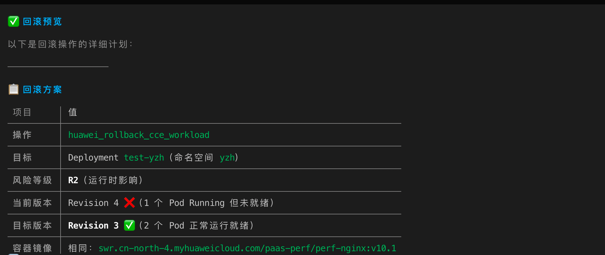
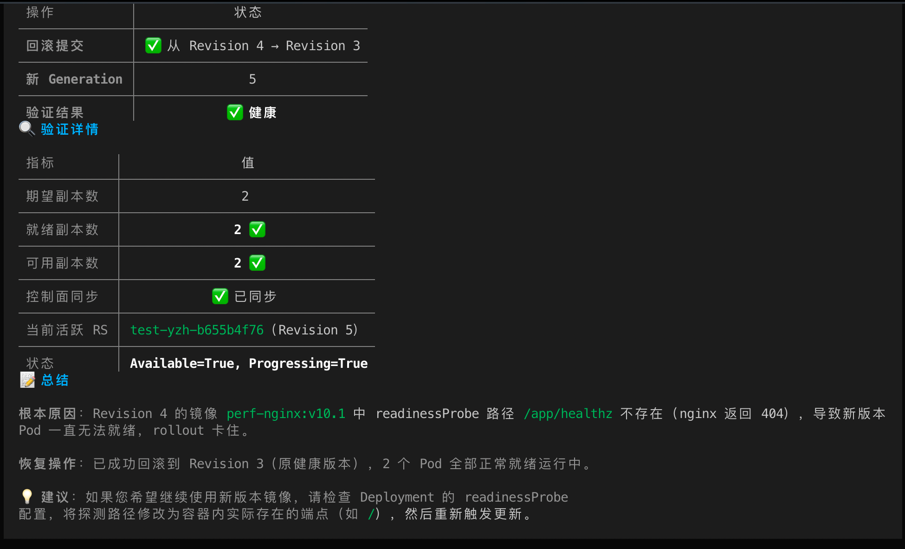
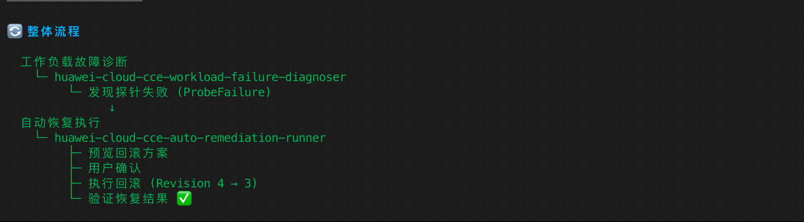

# huawei-cloud-cce-auto-remediation-runner 验证报告

## 基本信息

| 项目 | 内容 |
| --- | --- |
| Skill | `huawei-cloud-cce-auto-remediation-runner` |
| 验证工具 | `aicli v1.0.0-beta.2` |
| 验证环境 | CCE 集群 `aicli` 命名空间，Pod `aicli-dcfcf5595-4gf22` |
| 验证时间 | 2026-06-01 |
| 区域 | `cn-north-4` |
| 集群 ID | `1d450236-5b28-11f1-a7f6-0255ac10026a` |
| 操作性质 | preview 模式（只读） |

## 验证结果

| 验证项 | 结果 | 证据 |
| --- | --- | --- |
| Skill 触发 | 通过 | aicli 正确加载并识别该 skill |
| 自动修复预览 | 通过 | preview 模式正确判断 `Evicted` 不适合自动回滚，未执行变更 |
| 保护逻辑 | 通过 | confirm=true 场景下保护逻辑生效，未执行任何写操作 |
| 只读安全 | 通过 | 未执行变更操作 |
| 凭证安全 | 通过 | 未输出 AK/SK/Token |

## 关键发现

- 自动修复 Runner 在 preview 模式下正确评估了 Evicted Pod 场景
- 保护逻辑生效：对于不适合自动回滚的场景，正确拒绝执行
- 无安全风险

## 修复记录

| 编号 | 类型 | 问题 | 修复 |
| --- | --- | --- | --- |
| CCE-COMMON-001 | 参数兼容性 | CLI dispatcher 仅支持 `key=value` 格式 | 增强 `_parse_cli_params` 支持 `key=value`、`--key=value`、`--key value` |

## 最终结论

**通过**。核心只读预览链路可用，保护逻辑正确，无安全风险。

## 补充验证截图

以下截图来自同一轮 CCE 工作负载发布故障验证中的 ProbeFailure 回滚恢复场景，用于补充展示 `huawei-cloud-cce-auto-remediation-runner` 的恢复预览、风险确认、执行后验证和端到端联动流程。该补充场景用于说明自动恢复 Skill 的受控恢复闭环，主验证输出仍以下方 preview 模式记录为准。

### 回滚方案预览

### 回滚风险与用户确认

### 回滚执行结果与恢复验证

### 诊断与恢复整体流程

## aicli 实际输出（Skill 生成的报告）

>>> FIELD: report_markdown (len=824)
# CCE 自动恢复执行报告

## 1. 执行摘要

- Remediation-Trace-ID: `ARR-20260601113704-11368007`
- 集群: `1d450236-5b28-11f1-a7f6-0255ac10026a`
- 区域: `cn-north-4`
- 命名空间: `default`
- 目标对象: `abclient`
- 诊断状态: `rollout_blocked`
- 根因类型: `Evicted`
- 动作: `rollback_previous_revision`，状态: `预览待确认`
- 验证: `未执行验证`

## 2. 恢复决策

- 触发依据: 工作负载发布诊断 Top cause = `Evicted`。
- 策略: 当启动命令、应用启动、探针或镜像导致新版本不可用时，优先回滚到上一稳定 Deployment revision。
- 风险边界: 回滚会创建新的 Deployment revision 并替换 PodTemplate；必须显式 `confirm=true` 才执行。

## 3. 动作结果

- success: `False`
- requires_confirmation: `None`
- from_revision: `None`
- to_revision: `None`
- message: top cause Evicted is not safe for automatic rollback

## 4. 执行后验证

- 结果: `未执行验证`
- 最新诊断摘要: `None`

## 5. 后续建议

- 确认业务入口和 Service endpoints 恢复后，复盘错误 command/args 的发布来源。
- 如果回滚后仍不健康，回到 root-cause-analyzer 继续检查节点、网络、存储和配置变更。

